# Electrical: CAN Bus ESP32 TWAI
<small>
**Written by:** Ryan Joseph Brennan   **Edited & formatted by:** Me, the maintainer of this site
</small>

---

Our MoTeC M130 ECU spits data out over the CAN BUS. Our Embedded Systems must therefore interface with a CAN bus to receive engine data.

This document outlines the CAN bus protocol at a high level with an example built directly on the ESP32s3 (the chosen SoC for CR5)

---

## CAN and TWAI Overview

&emsp;&emsp;CAN (Controller Area Network) is a two-wire data transmission format that was invented by Bosch in the 1980s. In the 2020s, Ethernet has only just begun trying to phase out CAN. It will take a long time before CAN is (ever?) fully replaced.

&emsp;&emsp;Espressif, the manufacturer of our ESP32s3 SoC (System on Chip), calls their implementation of CAN, "TWAI", for "Two-Wire-Automotive-Interface." This is stupid. Proof that it is stupid: [https://github.com/espressif/esp-idf/issues/5580](https://github.com/espressif/esp-idf/issues/5580){ target="_blank" rel="noopener noreferrer" }. The rename was done in 2020. If you see any ESP32 code using "CAN", know that this doesn't work with post-2020 models, like our ESP32s3.

&emsp;&emsp;I'm going to use both "CAN" and "TWAI" terms interchangeably below. You must get it into your head that they are the same thing… Except nobody has heard of TWAI — except you :smile:

---

## The CAN Bus

Get ready for some funny words:

> *CAN is a multi-master, error-resistant, priority-supportive, broadcast-style, message-ID-based, differential signal data transmission protocol.*

Cool… Let's figure out what that means in our particular use case.

---

### TWAI Data Frame Format

&emsp;&emsp;There are many versions of the CAN standard. Espressif's TWAI is ISO11898-1 High Speed CAN 2.0 Classical Frame Compliant. TWAI transmits correctly over ISO 11898-2 compliant transceiver buses. **This means:**

> *TWAI supports bitrates anywhere from 25Kbit/s to 1Mbit/s. It can use either the Standard 11-bit Frame Format (211 = 2048 possible connections), or the Extended 29-bit Frame Format (536,870,912 connections). It **does not** support **CAN** FD (flexible data rate frames), nor does it support data field sizes **>** 8 bytes **like** in CAN FD and **CAN** XL specs. You should put no more than 30 nodes on the network at 1Mbit/s. Bus length should be **<** 40 meters. The two wires should be EMF shielded – or unshielded and twisted. The CAN HI and CAN LO wires must connect at both ends to each other through a 120Ω resistor.*

&emsp;&emsp;Our MoTeC M130 ECU operates at 1M/500k/256k/125kbps data rates using 11-bit Standard Frame format. We must configure our ESP SoC the same way.

&emsp;&emsp;Below is a picture from [Texas Instruments](https://www.ti.com/lit/an/sloa101b/sloa101b.pdf){ target="_blank" rel="noopener noreferrer" } of the type of data frame that we use for transmission. You must properly configure each message's **Identifier**, **RTR**, **IDE**, **DLC**, and **Data** fields, or it will not be interpreted correctly on our CAN bus.

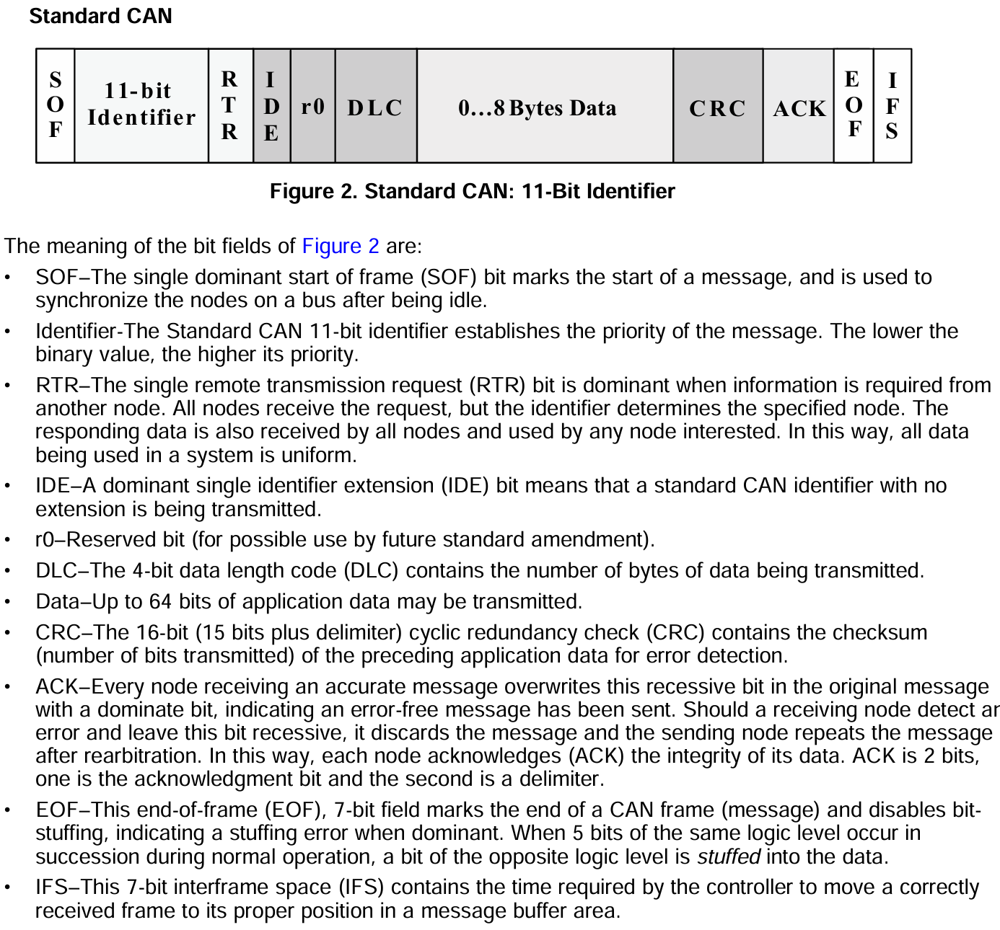

&emsp;&emsp;The rest of the fields are automatically bound to the message during transmission by the ESP32's onboard CAN controller circuit. The ESP32 only has a single CAN controller – but it can be re-routed to handle multiple CAN busses at the same time if you wanted to. We do not need to :smile:

---

### Differential, Dominant, and Recessive

#### Differential Signals

&emsp;&emsp;CAN operates with a "differential" signal. This means that what we interpret as a "1" or a "0" on one wire is strictly relative to the signal on its pair wire; in other words: the "difference" between the two wires determines whether we see a 1 or a 0. **A differential signal must have 2 wires.**

&emsp;&emsp;Differential signals are great for electrically noisy environments. With cars, we're often bundling dozens of wires together in tight proximity – which ALL generate EMFs (Electromagnetic Fields) when a current flows through them. Differential signals are a great way to counter this problem of wire signal interference.

---

  <b>Raw CAN LO & HI oscilloscope + logic analyzer output of 2x ESP32s3's talking.</b>

The difference between V+ (orange) and V- (blue) represents the differential signal.

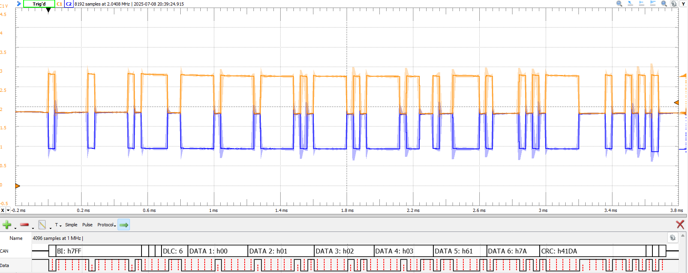

/// caption
*bit-rate = 25kHz; ID = 0x7FF; DataLength = 6; Data = {0, 1, 2, 3, 'a', 'z'};*
///

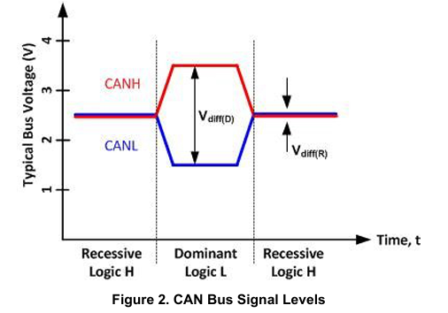

/// caption
Manual for Waveforms Protocol Analyzer: [https://files.digilent.com/manuals/WaveForms/3.22.1/protocol.html](https://files.digilent.com/manuals/WaveForms/3.22.1/protocol.html)

*Refer to these two images for the below as well….*
///

---

  <b>Raw CAN LO & HI oscilloscope + logic analyzer output of MoTeC M130 talking to ESP32.</b>

&emsp;&emsp;The difference between V+ (orange) and V- (blue) represents the differential signal. This bus was configured as: bit-rate=**1MHz**. That's 40x faster than above, and you can see we get some signal 'ringing' at that speed. Also, notice the voltage levels are different… But it doesn't matter! The signal is differential, and the subtraction of the two for binary interpretation (I put in red & purple) is the same! It's very clean.

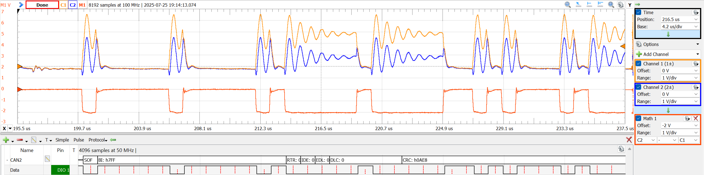

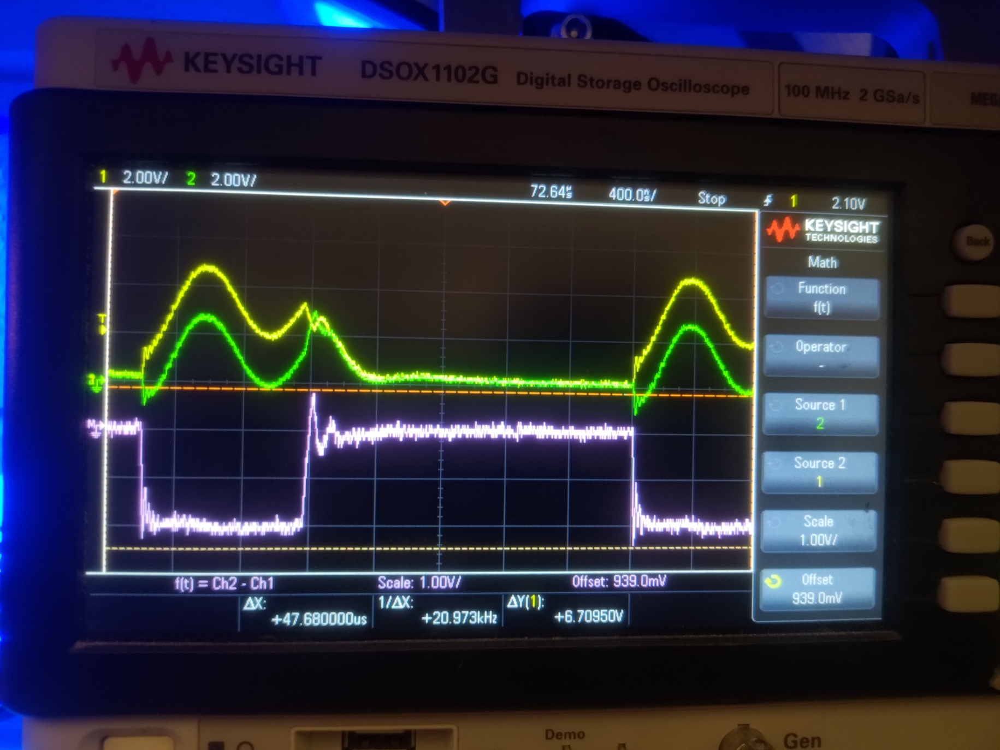

Next, let's talk about the verbiage for the CAN protocol and interpreting this signal…

---

#### Dominant & Recessive

- A "dominant" logic level occurs when V+ and V- stretch out… Big. Scarry. Dominant, even.
- A "recessive" logic level occurs when the V+ and V- lines remain quiet at the baseline voltage (~2v) in the above waveform… Timid. Chill. Recessive, some might even say.

&emsp;&emsp;That's all fine… but the verbiage gets a little screwy once you realize that **"dominant" means a binary '0' and "recessive" means a binary '1'**. Look at the logic analyzer at the bottom of the screenshots; see how the binary interpretation is '0' when blue and orange stretch dominant?

&emsp;&emsp;Thankfully, dominant/recessive becomes less confusing (but still irritating) when you recall that lower binary ID values on the CAN bus get priority. Therefore, if an ID of 5 (0b101) and 4 (0b100) were transmitted at the same time, the additional '0' on ID=4 transmission would eventually be sensed as each signal transmitted bit by bit - and it would win (dominate). IDs can be re-used.

---

## Transceivers & Controllers

&emsp;&emsp;The ESP32s3 has a CAN (TWAI) controller onboard. This is a physical hardware element. It is physically designed to carry out the CAN protocol.

&emsp;&emsp;Not all microcontrollers have CAN controllers onboard. Some have no support at all. Others mimic the CAN controller through software, which works but takes up computational time. Having a hardware CAN controller is great; it's like having an assistant. You can tell it to send a message – and then immediately forget about it. No need to worry about how to generate the pulses before you do something else; the hardware takes care of the rest. In addition, if a message comes in while you're busy – it'll get stored in a mailbox buffer until you're ready to read it in the main software loop. Don't take this for granted… If you were trying to mimic this in software and missed checking for a transmission – it would just be gone! Oh well, you missed it!

---

  <b>The interface of the TWAI Controller is just TX & RX.</b>

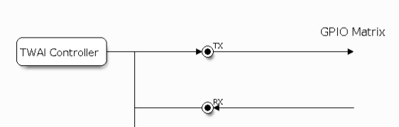

/// caption
:scream:
///

&emsp;&emsp;However, the CAN controller itself cannot produce a differential signal. Consider the dilemma: the single TX line, which is either '1' or '0', must control two CAN HI and CAN LO wires simultaneously to create a differential signal. You need another hardware element for this, which is called the CAN Transceiver. The transceiver merely translates the signal voltage levels from CAN HI/LO to an RX or TX line, and vice versa. We're using a TJA1050, but there's many options:

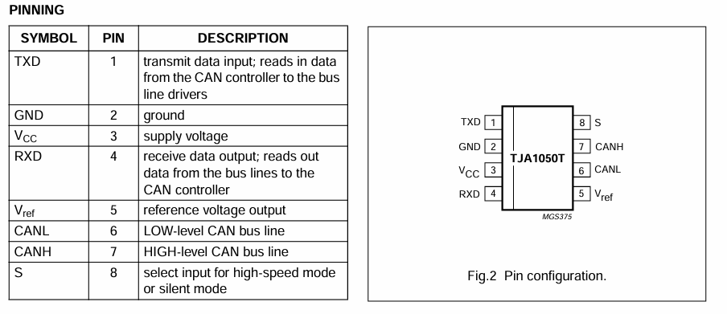

&emsp;&emsp;You may ask: Why does the ESP32s3 have a CAN controller built into it, but not a transceiver? Because screw you, that's why. It totally could, but it doesn't. The upshot is that this does grant us additional flexibility in our design – since we now get to be the ones to choose the transceiver.

---

## Wiring

&emsp;&emsp;I can't explain this better than Texas Instrument's summary of the ISO11898 standard… I'd refer to the standard directly, but ISO locks that behind a paywall, and this is just as good :). An offline copy of this full document is stored on the MS Teams filesystem. There are two ways to wire: standard 120 ohm and a 60-ohm split. Standard wiring has worked; split is usually unnecessary. Below, (μC = microcontroller)

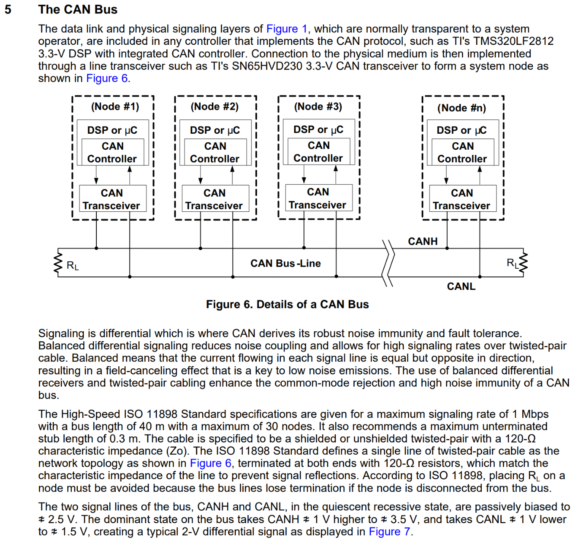

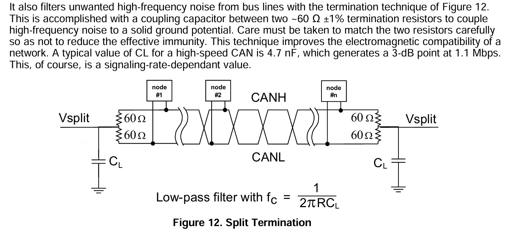

---

  <b>In ESP32 TWAI land, here is the wiring between 2x ESP32s3 & 2x TJA1050 dev modules.</b>

&emsp;&emsp;The ESP32s3 has multiplexed GPIO. Any signal that comes out over a GPIO pin can output to ANY GPIO. You can choose any 2 pins for the TWAI RX and TX pins. I chose pins 0 (orange wire) and 1(blue wire).

&emsp;&emsp;There are some extra power and sampling debug wires in my picture below. The connection is really quite simple: Set "S" LOW. Provide Power & GND. Connect ESP32 TX to TXD, and ESP32 RX to RXD. Connect the CAN H and CAN L to the CAN bus. Make sure the bus is terminated on both sides with 120 ohm resistors. If you are using modules like I did below, they probably already have resistors onboard. Remove them (de-solder probably) if the module is not intended to be the terminating transceiver node!

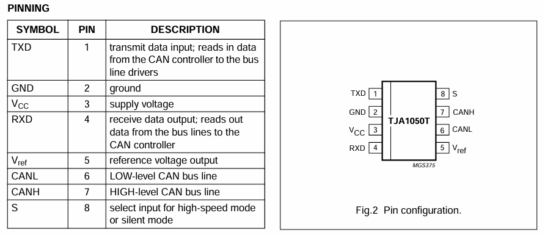

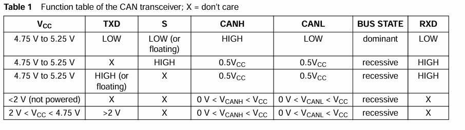

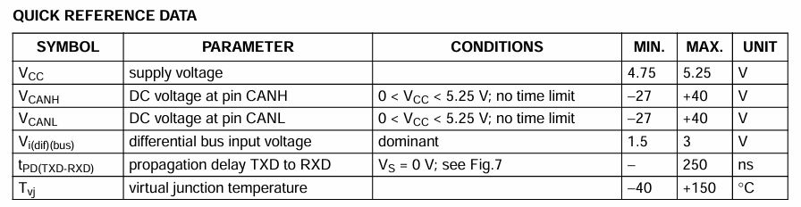

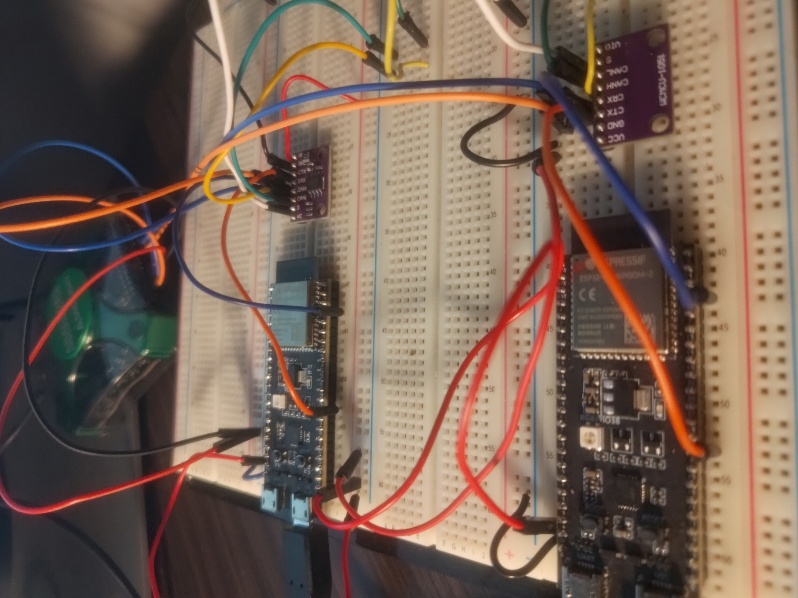

/// caption
:smile:
///

---

## TWAI Library Example

&emsp;&emsp;We're programming the ESP32s3 with the Espressif IDF [**I**oT (Internet of Things) **D**evelopment **F**ramework]. These guys *suck* at their names. They're better at software development, thankfully.

&emsp;&emsp;The IDF is a programming library that helps us step up from the bare-metal programming you did in the onboarding program. It is an abstraction layer; Espressif did the bare-metal programming — so you (probably) don't need to! You can think of it as an advanced version of the Arduino library.

&emsp;&emsp;However, if one of their hardware interface functions doesn't work… The datasheets are always there for you :smile:. They've got different colors, but it's the same exact thing. You could program bare-metal:

- [Hardware Reference - ESP32-S3 - ESP-IDF Programming Guide v5.4.2 documentation](https://docs.espressif.com/projects/esp-idf/en/stable/esp32s3/hw-reference/index.html){ target="_blank" rel="noopener noreferrer" }

This document is about CAN… err, TWAI... Here's the TWAI library docs:

- [Two-Wire Automotive Interface (TWAI) - ESP32 - ESP-IDF Programming Guide](https://docs.espressif.com/projects/esp-idf/en/stable/esp32/api-reference/peripherals/twai.html){ target="_blank" rel="noopener noreferrer" }

&emsp;&emsp;Espressif is very thorough with their documentation. The upshot is that their demo files typically demonstrate every feature they advertise (which is not something to be taken for granted). This is lovely once you know what you're doing. However, the information density can make it feel harder to get started.

&emsp;&emsp;The first step to understanding a confusing manual is to accept your fate; just read it and be confused. Then, try the example file. Thirdly, build your own code file, from scratch, as a limited version of the example file. This will help you understand what is truly necessary for the library to function, and what was just a feature demo to show you what's possible.

---

  <b>Here's an example message:</b>

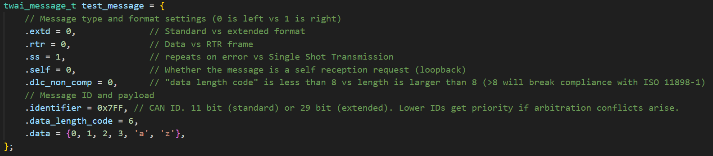

---

  <b>Here's an example initialization, installation, and startup of the TWAI driver:</b>

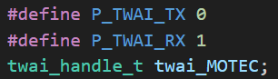
/// caption
*You can choose any regular GPIO pin for signal output on the ESP32. It has internal signal multiplexing. Very handy!*
///

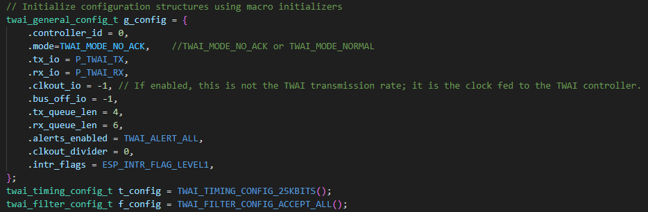

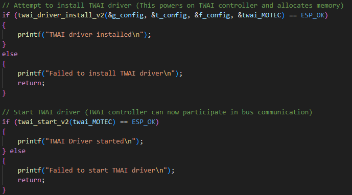

---

  <b>Here's an example transmission that sends a message every second and checks for send errors:</b>

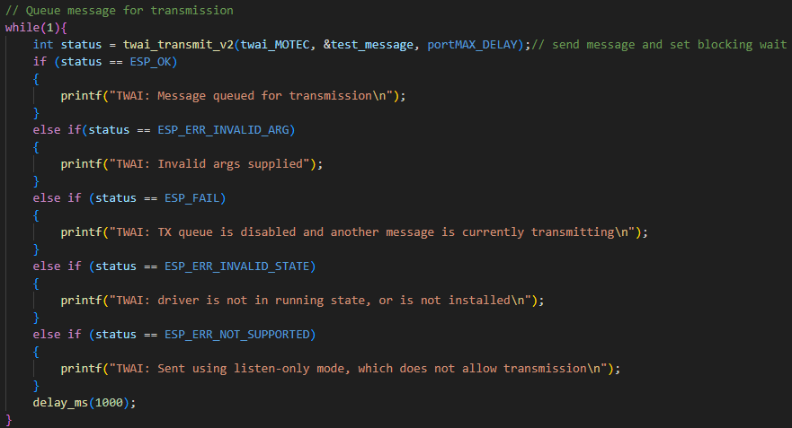

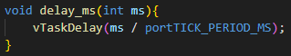

---

  <b>If you wanted to check the bus for alerts, here is an example of running that check:</b>

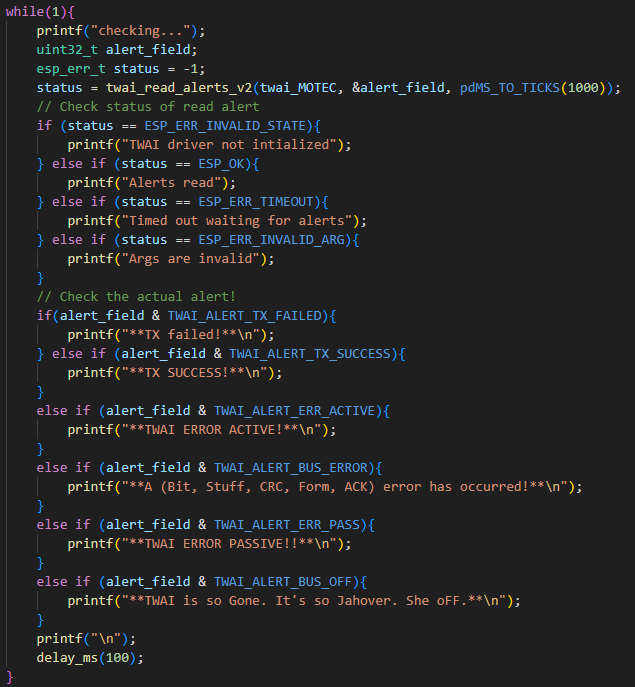

---

## Pitfalls

> "Those who make and record mistakes are the smartest former idiots" <small>or something idk…</small>

!!! warning "uhhh"
    Thank you Ryan, for that quote full of wisdom!

1. CAN is asynchronous. Make sure all elements on the CAN bus are configured to use the same clock speed. This includes any debugging logic analyzers you're trying to use.

2. If you have more than 2 transceivers on the CAN bus, make sure only the terminating transceivers in the bus have reflection-dampening 120-ohm resistors between CAN HI and LO. All non-terminating transceivers should simply be open-circuit between HI and LO.

3. If you only have one node on the CAN network and are trying to debug the bus with a logic analyzer, make sure you've also set the bus mode to `TWAI_MODE_NO_ACK`, or you will just get error frames since there is no acknowledgement signal from other nodes on the bus; the CAN controller thinks it is broken if there is no ACK, and therefore sends error frames.

4. **The RX line of a CAN controller must be able to listen to the TX line's signal.** If it cannot – you will get an error frame as the CAN controller assumes the message was not sent. With the TJA1050 transceiver, below, the TX (orange) input signal to the TJA is actually amplified and then sent back out to the RX (blue) terminal of the ESP32 controller.

    1. If you're in a pinch for some reason and don't have a transceiver, I have previously placed a 120-ohm resistor between the RX and TX terminals at the controller and that has worked for allowing the RX line to properly monitor the signal and remove error frames --- but this is not the proper way to do it by any means :smile:.

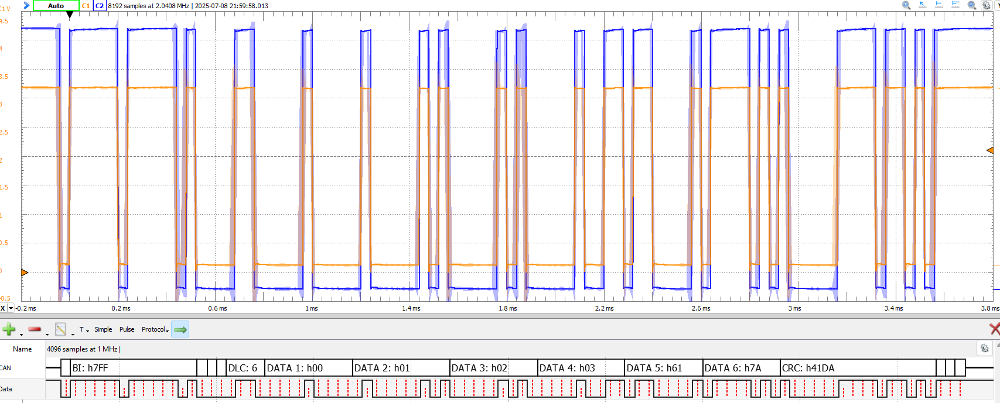
