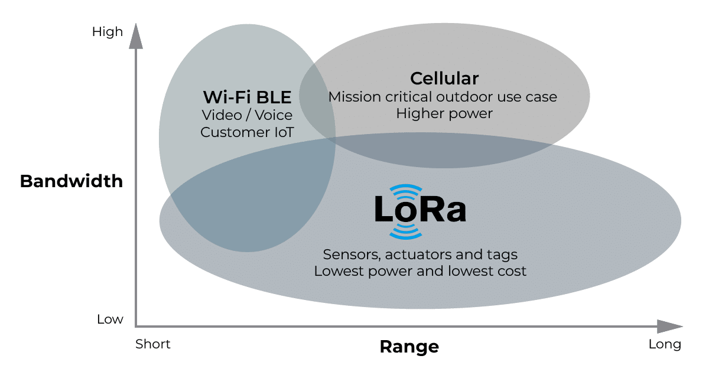
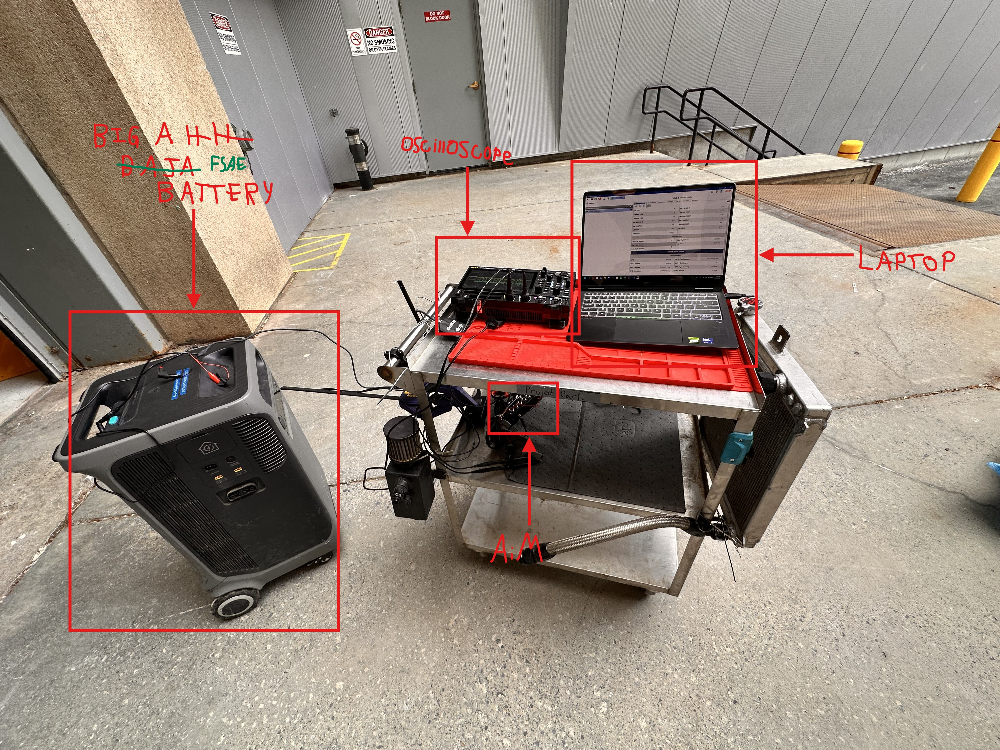
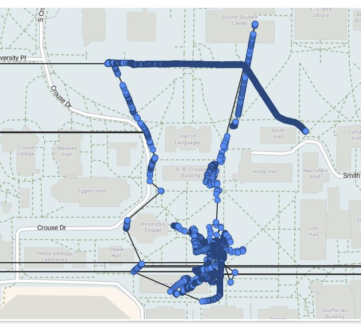
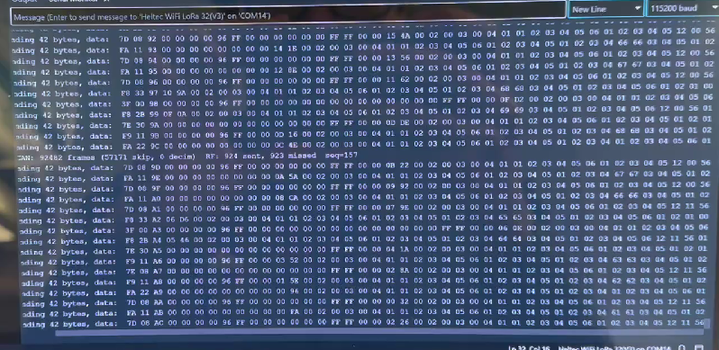
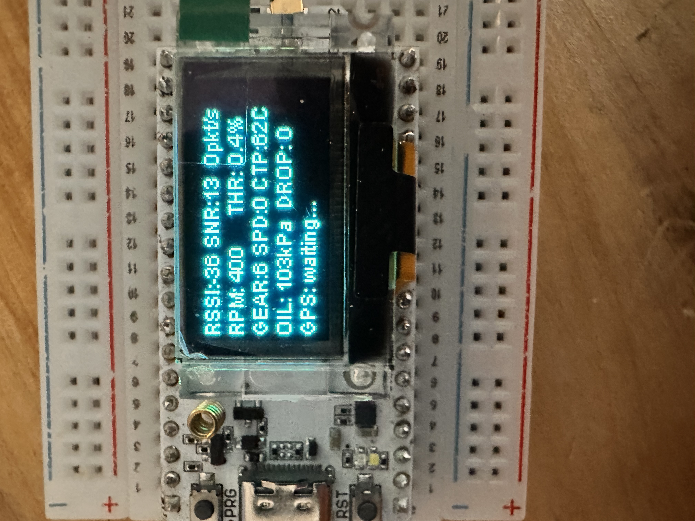
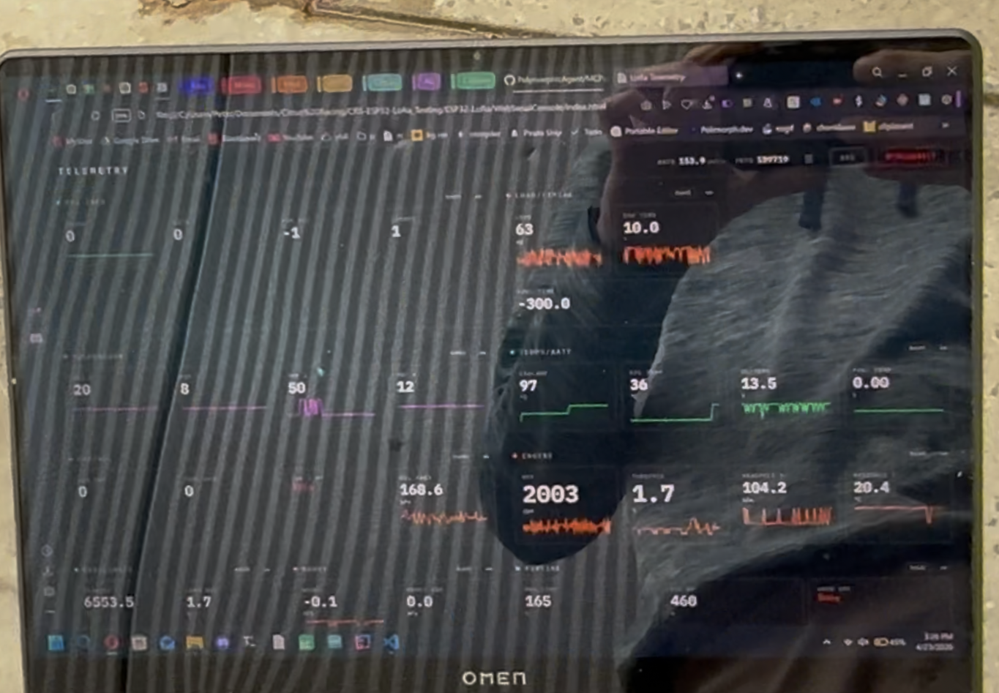
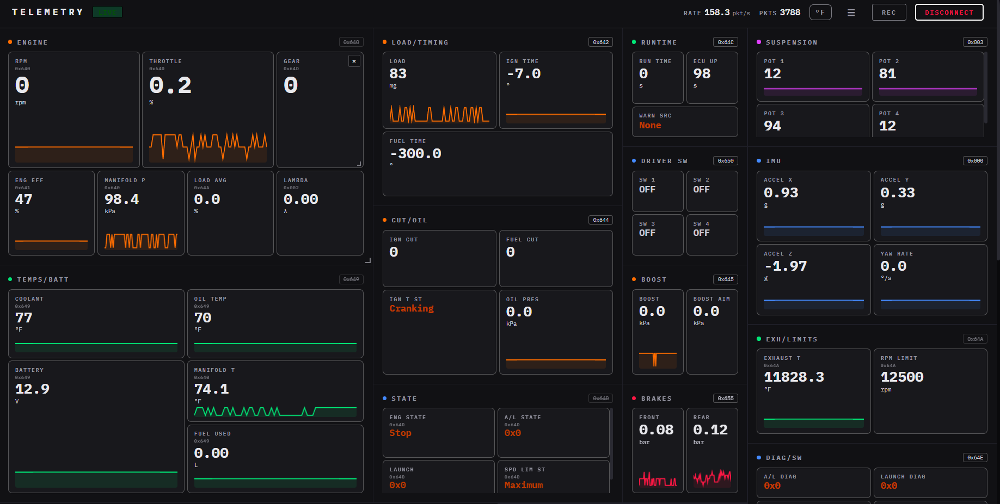

# Citrus Racing RF Telemetry
<small>
**Written & Formatted by:** Peter Fischi
</small>

---

## Mission Statement / Purpose

---

>In former years, data coming from the ECU was recorded onboard, and retrieved afterwards. This made engine tuning an absolute nightmare, as there was no way to see a live feed of data. As problems occurred (and oh, did they occur), whoever was tuning the engine had to sift through (thankfully timestamped) data and try to figure out what went wrong.

This project aims to gain live telemetry data from the running car's [CAN bus](#can) in a wireless fashion. That means **no wires**. :pray: 

---

## Current State

This subsystem currently meets MVP: it's transmitting and receiving the requested telemetry data over LoRa with **no wires**. The web dashboard is capable of displaying and recording all said data in real time. (thank you for your passion in graphic design, Claude!)

---

## Components

| Component&emsp;&emsp;&emsp;&emsp;&emsp;&emsp;&emsp;&emsp; | Description |
|---|---|
| 2x [Heltec Wifi LoRa 32 V3](https://heltec.org/project/wifi-lora-32-v3/){ target="_blank" rel="noopener noreferrer" } | A neat little [ESP32](#esp32) board with a built-in [LoRa](#lora) RF Transmitter/Reciever. |
| 1x [AiM EVO4S](https://www.aimtechnologies.com/aim-evo4s/){ target="_blank" rel="noopener noreferrer" } | Responsible for injecting data from the GPS, its on-board accelerometer, and 4 linear pots into the vehicle [CAN bus](#can). |
| 1x [AiM GPS08](https://www.aimsports.com/us/out-of-production/gps08-module/index.htm){ target="_blank" rel="noopener noreferrer" } | Plugs into the [AiM EVO4S](https://www.aimtechnologies.com/aim-evo4s/), sends GPS coordinates, speed, accuracy, yadda yadda. |
| 4x [AiM Linear Potentiometer](https://insert-site-here-once-i-get-a-model.number) | Plugs into the [AiM EVO4S](https://www.aimtechnologies.com/aim-evo4s/){ target="_blank" rel="noopener noreferrer" }, one connected in parallel to each suspension spring. |
| Various AiM-Branded Wires | Extremely over-priced proprietary connectors to deliver 12V to the [AiM EVO4S](https://www.aimtechnologies.com/aim-evo4s/){ target="_blank" rel="noopener noreferrer" }, connect the 4 [AiM Linear Potentiometers](https://insert-site-here-once-i-get-a-model.number){ target="_blank" rel="noopener noreferrer" }, and patch into the vehicle CAN bus. (Wait... Did I ever say any of the AiM stuff was fairly priced?) |
| 1x antenna | The amazon listing no longer exists :smile: |

!!!todo "TODO: Circumvent over-priced AiM Technologies"
    Design a custom board that reads potentiometer values, + custom GPS module, and outputs corresponding data on [CAN](#can). May be able to salvage the enclosure from the unused [AiM EVO4](https://www.aim-sportline.com/us/out-of-production/evo4/index.htm), or even the [AiM EVO4S](https://www.aimtechnologies.com/aim-evo4s/).

    **Note from the future:** This has been accomplished. There will be a new writeup linked here when it passes design reviews!

---

## Visual Diagram


---

## Jargon & Definitions

---

### ESP32

A really, really (, really, really (...really?)) useful and versatile microcontroller created and maintained by [Espressif Systems](https://www.espressif.com/){ target="_blank" rel="noopener noreferrer" }.

> ESP32 is a family of low-cost, energy-efficient microcontrollers that integrate both Wi-Fi and Bluetooth capabilities.

&emsp;&emsp;<small>
                <i> 
                    <a href="https://en.wikipedia.org/wiki/ESP32" target="_blank" rel="noopener noreferrer">
                        https://en.wikipedia.org/wiki/ESP32
                    </a>
                </i>
            </small>

The ESP32 is especially useful for us (over, say, a rpi or arduino), since it has a CAN implementation (NOT TRANSCEIVER). We will be using a board that encompasses both an ESP32 and [Lora](#lora) module. (See [components](#components))

If you don't know what a microcontroller is, **GET OU-** <small> oh that's mean i shouldn't say that </small> \*cough- have a little... chat with google. Maybe look at the [wikipedia page](https://en.wikipedia.org/wiki/Microcontroller){ target="_blank" rel="noopener noreferrer" }. Maybe consider... asking someone in person :scream: <small>ikr</small>

---

### LoRa

> LoRa (from "long range") is a physical proprietary radio communication technique based on spread spectrum modulation. LoRa can be thought of as the radio signal technology (similar to Wi-Fi or cellular).

> The technology is primarily used for applications where small amounts of data need to be transmitted infrequently from hard-to-reach locations.

&emsp;&emsp;<small>
                <i> 
                    <a href="https://en.wikipedia.org/wiki/LoRa" target="_blank" rel="noopener noreferrer">
                        https://en.wikipedia.org/wiki/LoRa
                    </a>
                </i>
            </small>



/// caption
High-level overview of LoRa
///

...which is a problem, since I was told to transmit **a whole crap ton** of stuff.

!!! todo "TODO"
    We need to reduce the amount of data we're sending over LoRa, in order to reduce our bandwidth and increase our transmission distance.

---

### CAN

Ryan Brennan has written this excellent write-up on CAN, which I've re-formatted [here](./CAN.md){ target="_blank" rel="noopener noreferrer" }. If you don't understand the definition below, go read it.

> CAN is a multi-master, error-resistant, priority-supportive, broadcast-style, message-ID-based, differential signal data transmission protocol.

???- example "Overview"
    - The ESP32 calls the CAN bus “**TWAI**,” for some stupid reason. If you walk up to me and say "**TWAI**," I will pretend like I don't understand. If you walk up to an ESP32 and say "**CAN**," it *actually* won't understand. 
    
    - **Definiton:** CAN is a data transmission protocol used mainly in things that go vroom. Since we go vroom, we use CAN.
    
        * A **CAN Bus** is ~~a bus that CAN hold passengers.~~ \*cough\* is how our ECU communicates with sensors, actuators, and programmers. This is really handy, since adding another component is as simple as running 2 short wires to the nearest can pair in your wiring harness. 
        
        * **A tirade against MoTeC:** There's a really handy dictionary that ships with all *decent* ECUs, called a "CAN database." These usually appear with the \*.dbc file extension, but use standard ASCII encoding. Each message sent over the CAN bus is 8 bytes wide, with each message being split up into multiple values of varying, arbitrary length, decided in advance by... **MoTeC**. In other words, all data coming off the CAN bus is **indecipherable** without said dictionary. Guess who didn't ship their ECU with a CAN database? **MOTEC, OF COURSE!** :partying_face: :partying_face: :partying_face: Thanks to some rando on some pre-historic forum, however, we were able to obtain a copy of this vital file (which was allegedly leaked by a sympathetic MoTeC engineer). 

!!! note "CAN Transceiver (or lack thereof)"
    Since there is no transceiver on the ESP32 board itself, we've soldered one onto our connector hub PCB to be able to translate CAN.

---

## The Development Story

The initial struggle was getting the AiM to output CAN, since we needed it to spit out GPS and accelerometer data. After much of a struggle, we got this working and brought it out for a test spin.

!!! warning "AiM MUST GET ACK"
    The AiM **WILL NOT** output packets properly (only the first message, several thousand times per second), if it does not receive an ACK from the CAN bus. If the ESP32 is your only other node, it must be set to `TWAI_MODE_NORMAL`, so it properly sends ACK signals.

---

### Test One


/// caption
The test rig we used to verify GPS and LoRa functionality.
///

I'll just re-iterate the outcome of that test by formatting my own writeup below:

Two main teams were used in this test:

1. The AIM - configured to transmit accelerometer and GPS data over CAN - was attached to a cart, alongside a Heltec ESP32 + LoRa - configured to translate CAN and transmit accelerometer and GPS data -, oscilloscope, and laptop. A large battery was wheeled along next to it. (seen in the image above)

2. A laptop connected to a Heltec ESP32 + LoRa - configured to receive and display accelerometer and GPS data - was carried around.

&emsp;&emsp;Both teams moved their equipment around campus, team 2 notifying team 1 over a phone call when packets were not received. It was observed that packets were received through one building (Hall of languages), but when the teams were positioned with the HOL and physics buildings blocking line of sight, no packets were received. As soon as team 1 cleared the corner of the physics building, packets were received, indicated by a jump through the building on the GPS map displayed on team 2’s laptop.

&emsp;&emsp;The teams then positioned themselves at opposite ends of that long road in front of schine, team 2 with high ground. With direct line of sight, packets were intermittently received when team 2 was at the guard booth and team 1 was approximately in front of schine (needs verification, exact distance unknown). It was noted that as the receiving antenna was pointed directly at team 1, no packets were received, but as the antenna was pointed orthogonally to team 1, packets were intermittently received. This raised questions about which antennas would be used in the actual car.

&emsp;&emsp;Data was recorded throughout and exported as a csv. As team 2 returned to link hall, the addition of GPS positional accuracy to the list of transmitted telemetry data was considered, as well as possibly changing the RF polling frequency and bandwidth due to the increased payload size with the transmission of more CAN ids.

???+ experiment "Takeaway"
    - GPS is functional. We need to add input rejection, as we cannot have our car traveling to Africa and back in a tenth of a second.

    
    /// caption 
    Case in point
    ///

    - We need to test with the addition of more CAN ids to the transmission list.
    - We need to select a final antenna and test with it.

---

### The Software Struggle

&emsp;&emsp;The telemetry system we used during testing sent each CAN message as a separate LoRa packet. This worked fine for 2-3 data sources, but completely broke when all the requested CAN IDs were added (some at 50Hz!). Each LoRa packet is comprised of a header and data (simplified here for the sake of clarity), so tiny packets at high rates meant most of the airtime was wasted on headers rather than data.

#### Implicit Mode

After doing more research, I discovered that there is a way to drastically decrease the size of the header, by enabling something called `Implicit Mode`.

>LoRa uses two types of packet formats for data transmission: explicit and implicit.

>In **explicit** mode, a LoRa packet includes the following elements:

> - **Preamble** is used to synchronize the receiver with the transmitter. It MUST consist of 8 symbols for all regions as mentioned in the LoRaWAN Regional Parameters document. However, the radio transmitter will add another 4.25 symbols resulting in a final preamble length of 8 + 4.25 = 12.25 symbols.

> - **PHDR (Physical Header)** is an optional element only present in the explicit mode that contains information about payload size and CRC (Cyclic Redundancy Check).

> - **PHDR_CRC (Header CRC)** is an optional field that contains an error detecting code for correcting errors in header.

>The PHDR and PHDR_CRC are encoded with the Coding Rate of 4/8.

> - **PHYPayload** contains the complete frame generated by the MAC layer. The maximum payload size varies by DR (Data Rate) and is region-specific.

> - **CRC** is an optional field that contains an error detecting code for correcting errors in the payload of uplink messages.

>The PHYPayload and CRC are encoded with one of the Coding Rates (4/5, 4/6, 4/7, or 4/8). The complete frame is then sent using one of the Spreading Factors (SF = 7 to 12).

>The following figure shows the physical layer structure of uplink and downlink packets that uses explicit mode.

>
> /// caption
> *Physical structure of an [explicit] uplink packet*
> ///

>
> /// caption
> *Physical structure of a[n explicit] downlink packet*
> ///

>In **implicit** mode, the header is removed from the packet where the payload size and Coding Rate are fixed or known in advance.

>Beacons use LoRa radio packet implicit mode for sending time synchronizing information from gateways to the end devices.

>The following figure shows the structure of a LoRa packet that uses the implicit mode.

>
> /// caption
> *Physical structure of an implicit packet*
> ///

&emsp;&emsp;<small>
                <i> 
                    <a href="https://www.thethingsnetwork.org/docs/lorawan/lora-phy-format/" target="_blank" rel="noopener noreferrer">
                        https://www.thethingsnetwork.org/docs/lorawan/lora-phy-format/
                    </a>
                </i>
            </small>

By enabling implicit mode, we eliminate a little redundancy, but still have nowhere near the datarate required to transmit each CAN ID as an individual LoRa packet.

---

#### Airtime Math

LoRa is fundamentally packet-based, so there's no way to stream continuous data. Every transmission pays a fixed cost:

| Component | Duration (Spreading Factor 7 & 500kHz Bandwidth) |
|---|---|
| Preamble (8 sym + 4.25 sync) | 3.14 ms |
| Explicit header (8 sym) | 2.05 ms |
| **Total overhead per packet** | **~5.2 ms** |

For an 8-byte CAN frame, a very large percentage (~~60%) of every transmission is overhead. The theoretical data rate is 21,875 bps, but effective throughput drops to ~30-40% of that when sending small packets individually.

I asked Claude to build a calculator to sweep all possible packet sizes and find the minimum that satisfies the throughput inequality provided by semtech:

$$\frac{8 \times L_{\text{usable}}}{T_{\text{packet}}(L)} \geq R_{\text{ingest}}$$

```java
// Semtech airtime formula (SX1262 datasheet eq. 6.1)
static int payloadSymbols(int L) {
    int num = 8 * L - 4 * SF + 28 + 16 * CRC - 20 * IH;
    int denom = 4 * (SF - 2 * DE);
    int ceil = (int) Math.ceil((double) num / denom);
    return 8 + Math.max(ceil * (CR + 4), 0);
}

static double packetAirtime(int L) {
    return (N_PREAMBLE + 4.25 + payloadSymbols(L)) * T_SYM;
}
```
&emsp;&emsp;<small>
                <i> 
                    <a href="https://cdn.sparkfun.com/assets/6/b/5/1/4/SX1262_datasheet.pdf" target="_blank" rel="noopener noreferrer">
                        https://cdn.sparkfun.com/assets/6/b/5/1/4/SX1262_datasheet.pdf
                    </a>
                    , pg. 41
                </i>
            </small>

???- abstract "Calculator Script Output"
    ```
    $ java LoRaAirtimeCalc.java
    ========================================================================
    LoRa Airtime Calculator
    ========================================================================
    SF=7  BW=500kHz  CR=4/5  CRC=on  Implicit  Pre=8sym
    Header=3B  T_sym=0.2560ms  T_pre=3.14ms

    16 CAN IDs (16-bit bitmask)
    Name                     Bytes   Rate      bps
    ------------------------ ----- ------ --------
    IMU                          8    10Hz      640
    GPS Lat/Lon                  8    10Hz      640
    GPS Spd/Sats                 8    10Hz      640
    EngSpd/Manif/Throt           8    50Hz     3200
    EngEff                       1    50Hz      400
    EngLoad/Ign/Fuel             6    50Hz     2400
    IgnCut/FuelCut/OilP          5    50Hz     2000
    Boost                        4    50Hz     1600
    Cool/Oil/Batt/Fuel           5    10Hz      400
    Exh/LoadAvg/SpdLim           6    10Hz      480
    RunTime/Up/Warn              5    10Hz      400
    State/Gear                   3    10Hz      240
    Diag/Switches                2    10Hz      160
    Driver Switches              1    10Hz       80
    Brake Pressures              4    10Hz      320
    Linear Pots, 20Hz compressed down to 10Hz w/ 8bit precision     8    10Hz      640
                                    TOTAL   14240 bps = 1780.0 B/s

    ------------------------------------------------------------------------
        L   Use     T_pkt   Eff bps   Margin      Fill      Idle
    ------------------------------------------------------------------------
        32    29   16.70ms     13889    -2.5%    16.3ms     0.0ms
        34    31   17.98ms     13790    -3.2%    17.4ms     0.0ms
        35    32   17.98ms     14235    -0.0%    18.0ms     0.0ms
        36    33   19.26ms     13704    -3.8%    18.5ms     0.0ms
        37    34   19.26ms     14120    -0.8%    19.1ms     0.0ms
        38    35   19.26ms     14535    +2.1%    19.7ms     0.4ms <-- MIN
        39    36   19.26ms     14950    +5.0%    20.2ms     1.0ms
        40    37   20.54ms     14408    +1.2%    20.8ms     0.2ms
        41    38   20.54ms     14798    +3.9%    21.3ms     0.8ms
        42    39   20.54ms     15187    +6.6%    21.9ms     1.4ms
        43    40   21.82ms     14663    +3.0%    22.5ms     0.6ms
        44    41   21.82ms     15029    +5.5%    23.0ms     1.2ms
        45    42   21.82ms     15396    +8.1%    23.6ms     1.8ms
        46    43   21.82ms     15762   +10.7%    24.2ms     2.3ms ***
        47    44   23.10ms     15235    +7.0%    24.7ms     1.6ms
        48    45   23.10ms     15582    +9.4%    25.3ms     2.2ms
        49    46   23.10ms     15928   +11.9%    25.8ms     2.7ms ***
        50    47   24.38ms     15420    +8.3%    26.4ms     2.0ms
        51    48   24.38ms     15748   +10.6%    27.0ms     2.6ms ***
        52    49   24.38ms     16076   +12.9%    27.5ms     3.1ms ***
        53    50   24.38ms     16404   +15.2%    28.1ms     3.7ms ***
        54    51   25.66ms     15898   +11.6%    28.7ms     3.0ms ***
        55    52   25.66ms     16209   +13.8%    29.2ms     3.5ms ***
        56    53   25.66ms     16521   +16.0%    29.8ms     4.1ms ***
        57    54   26.94ms     16033   +12.6%    30.3ms     3.4ms ***
        58    55   26.94ms     16330   +14.7%    30.9ms     4.0ms ***
        59    56   26.94ms     16627   +16.8%    31.5ms     4.5ms ***
        60    57   26.94ms     16924   +18.8%    32.0ms     5.1ms ***
        61    58   28.22ms     16440   +15.4%    32.6ms     4.4ms ***
        62    59   28.22ms     16723   +17.4%    33.1ms     4.9ms ***
        63    60   28.22ms     17007   +19.4%    33.7ms     5.5ms ***
        64    61   29.50ms     16540   +16.2%    34.3ms     4.8ms ***
        65    62   29.50ms     16811   +18.1%    34.8ms     5.3ms ***
        66    63   29.50ms     17082   +20.0%    35.4ms     5.9ms ***
        67    64   29.50ms     17354   +21.9%    36.0ms     6.5ms ***
        68    65   30.78ms     16892   +18.6%    36.5ms     5.7ms ***
        69    66   30.78ms     17152   +20.4%    37.1ms     6.3ms ***
        70    67   30.78ms     17412   +22.3%    37.6ms     6.9ms ***
        71    68   32.06ms     16966   +19.1%    38.2ms     6.1ms ***
        72    69   32.06ms     17216   +20.9%    38.8ms     6.7ms ***
        73    70   32.06ms     17465   +22.6%    39.3ms     7.3ms ***
        74    71   32.06ms     17715   +24.4%    39.9ms     7.8ms ***
        75    72   33.34ms     17274   +21.3%    40.4ms     7.1ms ***
        76    73   33.34ms     17514   +23.0%    41.0ms     7.7ms ***
        77    74   33.34ms     17754   +24.7%    41.6ms     8.2ms ***
        78    75   34.62ms     17329   +21.7%    42.1ms     7.5ms ***
        79    76   34.62ms     17560   +23.3%    42.7ms     8.1ms ***
        80    77   34.62ms     17791   +24.9%    43.3ms     8.6ms ***
        81    78   34.62ms     18022   +26.6%    43.8ms     9.2ms ***
        82    79   35.90ms     17602   +23.6%    44.4ms     8.5ms ***
        83    80   35.90ms     17825   +25.2%    44.9ms     9.0ms ***
        84    81   35.90ms     18048   +26.7%    45.5ms     9.6ms ***
        85    82   37.18ms     17642   +23.9%    46.1ms     8.9ms ***
        86    83   37.18ms     17857   +25.4%    46.6ms     9.4ms ***
        87    84   37.18ms     18072   +26.9%    47.2ms    10.0ms ***
        88    85   37.18ms     18287   +28.4%    47.8ms    10.6ms ***
        89    86   38.46ms     17887   +25.6%    48.3ms     9.9ms ***
        90    87   38.46ms     18095   +27.1%    48.9ms    10.4ms ***
        91    88   38.46ms     18303   +28.5%    49.4ms    11.0ms ***
        92    89   39.74ms     17915   +25.8%    50.0ms    10.3ms ***
        93    90   39.74ms     18116   +27.2%    50.6ms    10.8ms ***
        94    91   39.74ms     18317   +28.6%    51.1ms    11.4ms ***
        95    92   39.74ms     18519   +30.0%    51.7ms    11.9ms ***
        96    93   41.02ms     18136   +27.4%    52.2ms    11.2ms ***
        97    94   41.02ms     18331   +28.7%    52.8ms    11.8ms ***
        98    95   41.02ms     18526   +30.1%    53.4ms    12.3ms ***
        99    96   42.30ms     18154   +27.5%    53.9ms    11.6ms ***
        100    97   42.30ms     18343   +28.8%    54.5ms    12.2ms ***
        101    98   42.30ms     18533   +30.1%    55.1ms    12.8ms ***
        102    99   42.30ms     18722   +31.5%    55.6ms    13.3ms ***
        103   100   43.58ms     18355   +28.9%    56.2ms    12.6ms ***
        104   101   43.58ms     18539   +30.2%    56.7ms    13.2ms ***
        105   102   43.58ms     18722   +31.5%    57.3ms    13.7ms ***
        106   103   44.86ms     18367   +29.0%    57.9ms    13.0ms ***
        107   104   44.86ms     18545   +30.2%    58.4ms    13.6ms ***
        108   105   44.86ms     18723   +31.5%    59.0ms    14.1ms ***
        109   106   44.86ms     18902   +32.7%    59.6ms    14.7ms ***
        110   107   46.14ms     18551   +30.3%    60.1ms    14.0ms ***
        111   108   46.14ms     18724   +31.5%    60.7ms    14.5ms ***
        112   109   46.14ms     18897   +32.7%    61.2ms    15.1ms ***
        113   110   47.42ms     18556   +30.3%    61.8ms    14.4ms ***
        114   111   47.42ms     18725   +31.5%    62.4ms    14.9ms ***
        115   112   47.42ms     18893   +32.7%    62.9ms    15.5ms ***
        116   113   47.42ms     19062   +33.9%    63.5ms    16.1ms ***
        117   114   48.70ms     18725   +31.5%    64.0ms    15.3ms ***
        118   115   48.70ms     18890   +32.7%    64.6ms    15.9ms ***
        119   116   48.70ms     19054   +33.8%    65.2ms    16.5ms ***
        120   117   49.98ms     18726   +31.5%    65.7ms    15.7ms ***
        121   118   49.98ms     18886   +32.6%    66.3ms    16.3ms ***
        122   119   49.98ms     19046   +33.8%    66.9ms    16.9ms ***
        123   120   49.98ms     19206   +34.9%    67.4ms    17.4ms ***
        124   121   51.26ms     18883   +32.6%    68.0ms    16.7ms ***
        125   122   51.26ms     19039   +33.7%    68.5ms    17.3ms ***
        126   123   51.26ms     19195   +34.8%    69.1ms    17.8ms ***
        127   124   52.54ms     18879   +32.6%    69.7ms    17.1ms ***
        128   125   52.54ms     19032   +33.6%    70.2ms    17.7ms ***
        129   126   52.54ms     19184   +34.7%    70.8ms    18.2ms ***
        130   127   52.54ms     19336   +35.8%    71.3ms    18.8ms
        131   128   53.82ms     19025   +33.6%    71.9ms    18.1ms ***
        132   129   53.82ms     19174   +34.6%    72.5ms    18.6ms ***
        133   130   53.82ms     19322   +35.7%    73.0ms    19.2ms
        134   131   55.10ms     19019   +33.6%    73.6ms    18.5ms ***
        135   132   55.10ms     19164   +34.6%    74.2ms    19.1ms ***
        136   133   55.10ms     19309   +35.6%    74.7ms    19.6ms
        137   134   55.10ms     19454   +36.6%    75.3ms    20.2ms
        138   135   56.38ms     19154   +34.5%    75.8ms    19.5ms ***
        139   136   56.38ms     19296   +35.5%    76.4ms    20.0ms
        140   137   56.38ms     19438   +36.5%    77.0ms    20.6ms
        141   138   57.66ms     19145   +34.4%    77.5ms    19.9ms ***
        142   139   57.66ms     19284   +35.4%    78.1ms    20.4ms
        143   140   57.66ms     19423   +36.4%    78.7ms    21.0ms
        144   141   57.66ms     19562   +37.4%    79.2ms    21.5ms
        145   142   58.94ms     19273   +35.3%    79.8ms    20.8ms
        146   143   58.94ms     19408   +36.3%    80.3ms    21.4ms
        147   144   58.94ms     19544   +37.2%    80.9ms    22.0ms
        148   145   60.22ms     19261   +35.3%    81.5ms    21.2ms
        149   146   60.22ms     19394   +36.2%    82.0ms    21.8ms
        150   147   60.22ms     19527   +37.1%    82.6ms    22.4ms
        151   148   60.22ms     19660   +38.1%    83.1ms    22.9ms
        152   149   61.50ms     19381   +36.1%    83.7ms    22.2ms
        153   150   61.50ms     19511   +37.0%    84.3ms    22.8ms
        154   151   61.50ms     19641   +37.9%    84.8ms    23.3ms
        155   152   62.78ms     19368   +36.0%    85.4ms    22.6ms
        156   153   62.78ms     19495   +36.9%    86.0ms    23.2ms
        157   154   62.78ms     19623   +37.8%    86.5ms    23.7ms
        158   155   62.78ms     19750   +38.7%    87.1ms    24.3ms
        159   156   64.06ms     19481   +36.8%    87.6ms    23.6ms
        160   157   64.06ms     19605   +37.7%    88.2ms    24.1ms
        161   158   64.06ms     19730   +38.6%    88.8ms    24.7ms
        162   159   65.34ms     19466   +36.7%    89.3ms    24.0ms
        163   160   65.34ms     19589   +37.6%    89.9ms    24.5ms
        164   161   65.34ms     19711   +38.4%    90.4ms    25.1ms
        165   162   65.34ms     19833   +39.3%    91.0ms    25.7ms
        166   163   66.62ms     19573   +37.4%    91.6ms    24.9ms
        167   164   66.62ms     19693   +38.3%    92.1ms    25.5ms
        168   165   66.62ms     19813   +39.1%    92.7ms    26.1ms
        169   166   67.90ms     19557   +37.3%    93.3ms    25.4ms
        170   167   67.90ms     19675   +38.2%    93.8ms    25.9ms
        171   168   67.90ms     19793   +39.0%    94.4ms    26.5ms
        172   169   67.90ms     19910   +39.8%    94.9ms    27.0ms
        173   170   69.18ms     19658   +38.0%    95.5ms    26.3ms
        174   171   69.18ms     19773   +38.9%    96.1ms    26.9ms
        175   172   69.18ms     19889   +39.7%    96.6ms    27.4ms
        176   173   70.46ms     19641   +37.9%    97.2ms    26.7ms
        177   174   70.46ms     19755   +38.7%    97.8ms    27.3ms
        178   175   70.46ms     19868   +39.5%    98.3ms    27.9ms
        179   176   70.46ms     19982   +40.3%    98.9ms    28.4ms
        180   177   71.74ms     19737   +38.6%    99.4ms    27.7ms
        181   178   71.74ms     19848   +39.4%   100.0ms    28.3ms
        182   179   71.74ms     19960   +40.2%   100.6ms    28.8ms
        183   180   73.02ms     19720   +38.5%   101.1ms    28.1ms
        184   181   73.02ms     19829   +39.2%   101.7ms    28.7ms
        185   182   73.02ms     19939   +40.0%   102.2ms    29.2ms
        186   183   73.02ms     20048   +40.8%   102.8ms    29.8ms
        187   184   74.30ms     19811   +39.1%   103.4ms    29.1ms
        188   185   74.30ms     19918   +39.9%   103.9ms    29.6ms
        189   186   74.30ms     20026   +40.6%   104.5ms    30.2ms
        190   187   75.58ms     19793   +39.0%   105.1ms    29.5ms
        191   188   75.58ms     19898   +39.7%   105.6ms    30.0ms
        192   189   75.58ms     20004   +40.5%   106.2ms    30.6ms
        193   190   75.58ms     20110   +41.2%   106.7ms    31.2ms
        194   191   76.86ms     19879   +39.6%   107.3ms    30.4ms
        195   192   76.86ms     19983   +40.3%   107.9ms    31.0ms
        196   193   76.86ms     20087   +41.1%   108.4ms    31.6ms
        197   194   78.14ms     19861   +39.5%   109.0ms    30.8ms
        198   195   78.14ms     19963   +40.2%   109.6ms    31.4ms
        199   196   78.14ms     20066   +40.9%   110.1ms    32.0ms
        200   197   78.14ms     20168   +41.6%   110.7ms    32.5ms
        201   198   79.42ms     19944   +40.1%   111.2ms    31.8ms
        202   199   79.42ms     20044   +40.8%   111.8ms    32.4ms
        203   200   79.42ms     20145   +41.5%   112.4ms    32.9ms
        204   201   80.70ms     19925   +39.9%   112.9ms    32.2ms
        205   202   80.70ms     20024   +40.6%   113.5ms    32.8ms
        206   203   80.70ms     20123   +41.3%   114.0ms    33.3ms
        207   204   80.70ms     20222   +42.0%   114.6ms    33.9ms
        208   205   81.98ms     20004   +40.5%   115.2ms    33.2ms
        209   206   81.98ms     20101   +41.2%   115.7ms    33.7ms
        210   207   81.98ms     20199   +41.8%   116.3ms    34.3ms
        211   208   83.26ms     19985   +40.3%   116.9ms    33.6ms
        212   209   83.26ms     20081   +41.0%   117.4ms    34.2ms
        213   210   83.26ms     20177   +41.7%   118.0ms    34.7ms
        214   211   83.26ms     20273   +42.4%   118.5ms    35.3ms
        215   212   84.54ms     20061   +40.9%   119.1ms    34.6ms
        216   213   84.54ms     20155   +41.5%   119.7ms    35.1ms
        217   214   84.54ms     20250   +42.2%   120.2ms    35.7ms
        218   215   85.82ms     20041   +40.7%   120.8ms    35.0ms
        219   216   85.82ms     20134   +41.4%   121.3ms    35.5ms
        220   217   85.82ms     20227   +42.0%   121.9ms    36.1ms
        221   218   85.82ms     20321   +42.7%   122.5ms    36.6ms
        222   219   87.10ms     20114   +41.2%   123.0ms    35.9ms
        223   220   87.10ms     20206   +41.9%   123.6ms    36.5ms
        224   221   87.10ms     20298   +42.5%   124.2ms    37.1ms
        225   222   88.38ms     20094   +41.1%   124.7ms    36.3ms
        226   223   88.38ms     20185   +41.7%   125.3ms    36.9ms
        227   224   88.38ms     20275   +42.4%   125.8ms    37.5ms
        228   225   88.38ms     20366   +43.0%   126.4ms    38.0ms
        229   226   89.66ms     20164   +41.6%   127.0ms    37.3ms
        230   227   89.66ms     20253   +42.2%   127.5ms    37.9ms
        231   228   89.66ms     20343   +42.9%   128.1ms    38.4ms
        232   229   90.94ms     20144   +41.5%   128.7ms    37.7ms
        233   230   90.94ms     20232   +42.1%   129.2ms    38.3ms
        234   231   90.94ms     20320   +42.7%   129.8ms    38.8ms
        235   232   90.94ms     20408   +43.3%   130.3ms    39.4ms
        236   233   92.22ms     20212   +41.9%   130.9ms    38.7ms
        237   234   92.22ms     20298   +42.5%   131.5ms    39.2ms
        238   235   92.22ms     20385   +43.2%   132.0ms    39.8ms
        239   236   93.50ms     20192   +41.8%   132.6ms    39.1ms
        240   237   93.50ms     20277   +42.4%   133.1ms    39.6ms
        241   238   93.50ms     20363   +43.0%   133.7ms    40.2ms
        242   239   93.50ms     20448   +43.6%   134.3ms    40.8ms
        243   240   94.78ms     20257   +42.3%   134.8ms    40.0ms
        244   241   94.78ms     20341   +42.8%   135.4ms    40.6ms
        245   242   94.78ms     20425   +43.4%   136.0ms    41.2ms
        246   243   96.06ms     20237   +42.1%   136.5ms    40.5ms
        247   244   96.06ms     20320   +42.7%   137.1ms    41.0ms
        248   245   96.06ms     20403   +43.3%   137.6ms    41.6ms
        249   246   96.06ms     20486   +43.9%   138.2ms    42.1ms
        250   247   97.34ms     20299   +42.6%   138.8ms    41.4ms
        251   248   97.34ms     20381   +43.1%   139.3ms    42.0ms
        252   249   97.34ms     20464   +43.7%   139.9ms    42.5ms
        253   250   98.62ms     20279   +42.4%   140.4ms    41.8ms
        254   251   98.62ms     20360   +43.0%   141.0ms    42.4ms
        255   252   98.62ms     20441   +43.5%   141.6ms    42.9ms

    ========================================================================
    RECOMMENDED OPERATING POINTS
    ========================================================================

        [Minimum viable]  L = 38 B (35 usable)
            Airtime:    19.26 ms
            Fill time:  19.66 ms
            Idle gap:   0.40 ms
            Pkt rate:   50.9 pkt/s
            Duty cycle: 98.0%
            Margin:     +2.1%
            >>> AGG_PACKET_SIZE_BYTES    38
            >>> AGG_TRANSMIT_INTERVAL_US 19662

        [Moderate]  L = 46 B (43 usable)
            Airtime:    21.82 ms
            Fill time:  24.16 ms
            Idle gap:   2.33 ms
            Pkt rate:   41.4 pkt/s
            Duty cycle: 90.3%
            Margin:     +10.7%
            >>> AGG_PACKET_SIZE_BYTES    46
            >>> AGG_TRANSMIT_INTERVAL_US 24157

        [Comfortable]  L = 67 B (64 usable)
            Airtime:    29.50 ms
            Fill time:  35.96 ms
            Idle gap:   6.45 ms
            Pkt rate:   27.8 pkt/s
            Duty cycle: 82.1%
            Margin:     +21.9%
            >>> AGG_PACKET_SIZE_BYTES    67
            >>> AGG_TRANSMIT_INTERVAL_US 35955

        [Very safe]  L = 95 B (92 usable)
            Airtime:    39.74 ms
            Fill time:  51.69 ms
            Idle gap:   11.94 ms
            Pkt rate:   19.3 pkt/s
            Duty cycle: 76.9%
            Margin:     +30.0%
            >>> AGG_PACKET_SIZE_BYTES    95
            >>> AGG_TRANSMIT_INTERVAL_US 51685
    ```
[:material-github: View Script on GitHub](https://github.com/Citrus-Racing/CR5-ESP32-LoRa_Testing/blob/main/ESP32-LoRa/LoRaAirtimeCalc.java){ .md-button target="_blank" rel="noopener noreferrer" }

---

#### Packet Aggregation

Instead of sending one LoRa packet per CAN frame, we buffer multiple CAN messages and pack them into a single fixed-size LoRa packet, which we send on a timed interval. One large packet amortizes the preamble cost across the entire batch. However, if that packet is dropped due to interference, we lose **all** CAN messages in that packet.

##### Data Budget

| Group | CAN IDs | Rate | Bits/sec |
|---|---|---|---|
| AIM fast (LIN POTS) | 1 | 10 Hz (compressed from 20 Hz) | 640 |
| AIM slow (IMU, GPS) | 3 | 10 Hz | 1,920 |
| ECU fast (RPM, throttle, load) | 3 | 50 Hz (decimated from 100 Hz) | 6,000 |
| ECU medium (cuts, boost) | 2 | 50 Hz | 3,600 |
| ECU slow (temps, state, switches) | 7 IDs | 10 Hz | 2,080 |
| **Total** | **16 IDs** | | **14,240 bps** |

##### Operating Point

With implicit mode (no LoRa header), CRC on, and a 3-byte indexing header:

| Parameter | Value |
|---|---|
| Packet size | 67 bytes (64 usable) |
| Packet airtime | 29.50 ms |
| Send interval | 35.96 ms |
| Throughput margin | +21.9% |
| Duty cycle | 82.1% |

---

#### Packet Format

I hard-coded both the transmitter and receiver with the same packet structure, so we can enable Implicit mode, which disables transmission of packet length and coding rate, saving ~2 ms per packet.

```
Byte 0-1:  16-bit presence bitmask (Nth bit set = Nth data follows)
Byte 2:    8-bit rolling sequence number
Byte 3+:   concatenated CAN payloads, ascending slot order, zero-padded to 64 bytes
```

The bitmask makes each packet self-describing. Not every CAN ID must appear in each packet, so data can enter each packet regardless of its rate (10 Hz or 50 Hz), and the receiver loops through the set bits to know exactly which payloads are present, and how many bytes to read for each.

---

#### Transmitter

The `RfAggregator` class handles buffering and timing. We feed it CAN frames as they arrive, and call `poll()` repeatedly, which handles the sending and buffering:

```cpp
// CAN ISR/task feeds data in
agg->feed(msg.identifier, msg.data, msg.data_length_code);

// poll() fires on a timer, builds a packet from dirty slots, sends it
agg->poll();
```

Inside `RfAggregator`, we assign each CAN ID a slot index. When we call `feed()`, the payload gets copied into a queue and the slot is marked dirty. When `poll()` gets called from our loop and the radio is free, `_buildPacket()` walks through the dirty flags, packs what fits into a buffer, clears the respective flags, zero-pads the buffer to `67` bytes, and (finally) hands it off to the radio.

I've bounded the CAN receive loop to 64 frames per iteration to ensure that packets get sent even when no CAN data is received.

!!! warning "No Serial Printing From CAN Loop!"
    I had to remove per-frame serial logging as it's a blocking operation, and was causing can packets to be skipped. Instead, we keep track of what's sent and print it to serial occasionally. This, of course, is disabled when no serial interface is open.



/// caption 
NB: when this screenshot was taken, we were sending 42 B/packet. That has now changed to 67 B/packet.
///

---

#### Receiver

`CanDecoder.h` contains a decode function for each of the 16 CAN IDs, driven by a dispatch table which is indexed by slot number:

```cpp
typedef void (*DecodeFn)(const uint8_t* data, OledState& oled, bool verbose);

static const DecodeFn DECODERS[] = {
  decode_0x000, decode_0x001, decode_0x002, decode_0x003,   // AIM
  decode_0x640, decode_0x641, decode_0x642,   // ECU fast
  decode_0x644, decode_0x645,                 // ECU 50Hz
  decode_0x649, decode_0x64A, decode_0x64C,   // ECU 10Hz
  decode_0x64D, decode_0x64E, decode_0x650, decode_0x655
};
```

Each function reads the raw bytes (big-endian for MoTeC M1, little-endian for AIM), applies scaling, and prints a JSON line:

```json
{"id":"0x640","rpm":6842,"manifPres":101.3,"manifTemp":25.0,"throttle":45.2}
{"id":"0x649","coolTemp":82,"oilTemp":95,"battVolt":13.2,"fuelUsed":1.45}
{"id":"0x000","ax":0.02,"ay":-0.01,"az":-1.05,"rr":0.34}
```

We also substitute what enumeration values we know about from MoTeC.

We watch the rolling sequence number, which should increment for each packet, to detect dropped packets. The OLED shows RPM, throttle, gear, coolant temp, oil pressure, GPS coordinates, and link stats, although I rarely watch that.


/// caption
First successful transmission test with all CAN IDs
///

---

#### --- AI WARNING ---

#### Web Dashboard {: .collapse-subs }

My initial web dash design was very inefficient and looked terrible. Claude was tasked to rebuild it from scratch to handle several hundred packets/sec without lag. The corresponding notes below were also created by Claude. It's safe to say that while graphic design IS my passion (lol), Claude IS better than me at it! 

**That's all from a real human, the rest is AI-generated from here. Until next time! :wave:**


///caption 
Picture of laptop running the web dashboard while car running
///


///caption
Screenshot of the dashboard
///

---

##### Upgrade Overview

/// caption
///

The old dashboard created DOM elements and redrew canvases on every incoming packet. At 3 IDs this was fine; at 16 IDs × 50 Hz it would freeze the browser. The new version separates data ingestion from rendering. Sparkline data uses typed `Float32Array` ring buffers with O(1) push, replacing `Array.shift()` which was O(n) and triggered garbage collection.

---

##### Summary
///caption
///

The WebSerialConsole is a browser-based real-time telemetry dashboard that receives LoRa-relayed CAN bus data from a race car via WebSerial. It decodes JSON packets from a receiver ESP32, renders live gauges with sparklines, and records sessions to IndexedDB for CSV export.

The entire frontend is a single-page application: one HTML file, one CSS file, one JS file (~1500 lines), plus Leaflet for the GPS map. No build tools, no framework — runs from a local `file://` or any static server.

---

##### File Structure
///caption
///

```
WebSerialConsole/
├── index.html         — Page shell: header, settings drawer, grid, panels, modals
├── css/
│   ├── style.css      — All custom styles (~260 lines)
│   └── leaflet.css    — Leaflet map styles (vendored)
├── js/
│   ├── telemetry.js   — All application logic (~1540 lines)
│   └── leaflet.js     — Leaflet library (vendored)
├── fonts/             — IBM Plex Mono + Sans (local @font-face, not in repo)
└── assets/            — (empty, reserved)
```

---

##### Data Pipeline {: .collapse-subs }
///caption
///

`ESP32 → WebSerial → readLoop → processLine → store/rings/dirty → render → DOM`

###### 1. WebSerial Connection

The browser's WebSerial API opens a serial port at 115200 baud. A `readLoop` reads lines from the serial stream, strips whitespace, and passes each to `processLine`. Connection state is reflected in the header badge (OFFLINE / LIVE) and the CONNECT / DISCONNECT button.

###### 2. Packet Processing

Each line starting with `{` is parsed as JSON. The `id` field (e.g., `"0x640"`) routes the packet to the correct entry in `store[id]`. Field values are written to `store`, sparkline ring buffers are pushed, enum fields are resolved via `ENUM_REV` lookup tables, and the CAN ID is marked `dirty[id] = true`. Warning Source transitions and Engine State transitions fire toast notifications.

All parsed packets are unconditionally appended to the active recording's `entries` array (no throttle, no sampling).

###### 3. Data Stores

| Store | Type | Purpose |
|-------|------|---------|
| `store[canId]` | `Object` | Latest value for every field of every CAN ID |
| `rings[canId.fieldKey]` | `Ring` (Float32Array) | Last 60 samples for sparkline rendering |
| `dirty[canId]` | `boolean` | Marks which CAN IDs have new data since last render |

The `Ring` class is a fixed-capacity circular buffer backed by `Float32Array` with O(1) push and lazy min/max bounds computation.

###### 4. Render Loop

`sched()` requests a single `rAF` frame. `render()` iterates `REGISTRY`, skipping clean CAN IDs. For each dirty ID, it looks up every field's gauge DOM element via `gaugeEls[canId.fieldKey]` and updates:

- **Numeric gauges**: `toFixed(fmt)` with optional °C→°F conversion
- **Flag gauges**: "ON" / "OFF"
- **Enum gauges**: Resolved string or hex fallback
- **Sparklines**: `drawSpark()` plots the ring buffer on a `<canvas>` with DPR scaling

The log panel is batch-rebuilt via `innerHTML` on a separate dirty flag, throttled per CAN ID (200ms visual interval).

---

##### Layout System {: .collapse-subs }
///caption
///

The dashboard uses a **two-level CSS Grid** architecture:

###### Outer Grid

```
#grid: 8 columns × N rows (90px fixed row height)
```

Each panel (`.widget`) is placed with explicit `grid-column` and `grid-row` spanning. Panels are identified by a **Panel ID (pid)** — either `reg_0x640` for REGISTRY-derived panels or `custom_1` for user-created panels.

Layout state: `lay[pid] = { c, r, cw, rh }` (column start, row start, column span, row span).

###### Inner Grid

```
.widget-body: 8 columns × auto rows (36px min row height)
```

Each gauge (`.gauge`) spans N columns and M rows within its panel's inner grid. Gauge state: `gaugeState[gaugeKey] = { hidden, cols, rh }`.

###### Collision Resolution

When a panel is moved or resized, `resolveCollisions(movedId)` pushes overlapping panels downward, then `compactGrid()` slides all panels upward to fill vertical gaps. Both operate on the `lay` map and `W[pid].el` visibility.

###### Persistence

Layout is stored in `localStorage` under `tl_layout_v3` as JSON containing: `panels`, `gaugeState`, `lay`, `panelVis`, `nextPid`. On load, `rebuildWidgets()` reads this and reconstructs the DOM. The same JSON structure is used for file-based export/import.

---

##### Panel System {: .collapse-subs }
///caption
///

###### IMMUTABLE REGISTRY

`REGISTRY` is a static array of 16 CAN ID definitions. Each entry specifies an ID, name, color, and field list with labels, units, format specifiers, and sparkline/big/flag/enum markers. `REG_MAP[canId]` provides O(1) lookup. REGISTRY is **never modified** — it is the source of truth for data decoding.

###### GAUGE_CAT (Derived, Immutable)

`GAUGE_CAT[canId.fieldKey]` is a flat catalog of every individual gauge definition, derived from REGISTRY at startup. Each entry carries its source CAN ID, label, unit, format, and feature flags.

###### Panels (Mutable)

`panels` is a mutable array of panel definitions:

```js
{
  pid: 'reg_0x640',           // panel ID
  name: 'ENGINE',             // editable display name
  color: '#ff6d00',           // editable panel color
  isMap: false,               // true for the GPS map panel
  gauges: ['0x640.rpm', ...], // ordered list of gauge keys
  defaultGauges: ['0x640.rpm', ...], // snapshot from REGISTRY (for "modified?" check)
}
```

Gauges can be moved between panels via drag-and-drop or the settings drawer dropdown. When a panel's gauge set differs from `defaultGauges` (set comparison, order-independent), the panel is marked "modified": the corner CAN ID tag gets a strikethrough and each gauge shows its source CAN ID.

###### GaugeEls (DOM Cache)

`gaugeEls[canId.fieldKey]` maps every visible gauge to its DOM elements: `{ val, cvs, ctx, color, el }`. This flat map decouples the render loop from panel membership — the renderer iterates by CAN ID (for dirty checks) and looks up gauge DOM elements by key regardless of which panel they belong to.

---

##### Interaction Systems {: .collapse-subs }
///caption
///

###### Panel Drag

`initDrag()` registers pointer event handlers on `D.grid`. Pointerdown on a `.widget-head` initiates move mode; pointerdown on a `.resize-handle` initiates resize mode. A dashed green ghost element previews the target position/size. On pointerup, `resolveCollisions` + `compactGrid` run, then layout is saved.

The handler skips drag when the pointerdown target is a `contenteditable` title or color dot.

###### Gauge Drag

`initGaugeDrag()` uses HTML5 drag/drop (separate from pointer-based panel drag). Each gauge has `draggable="true"`. Dragstart stores the gauge key; drop on a `.widget-body` moves the gauge to the target panel. Dropping on a gauge within the same panel reorders by inserting before the drop target. The panel body highlights with a dashed outline during dragover.

###### Gauge Resize

`initGaugeResize()` handles pointerdown on `.gauge-resize` (corner grip). Horizontal drag changes column span (1–8); vertical drag changes row span (1–6). A size badge (e.g., `4×2`) appears during the resize. Pointer capture ensures the gauge receives all move/up events.

###### Panel Title Editing

Panel titles have `contenteditable="true"`. On blur, the new text is saved to the panel definition. The pointerdown handler skips drag initiation when the target is the title element.

###### Panel Color Editing

Clicking the colored dot next to the title opens a native `<input type="color">`. Live `input` events update the panel color and all its gauges' sparkline colors. The input self-removes on `change`.

---

##### Recording System {: .collapse-subs }
///caption
///

###### In-Memory

`rec.cur = { id, name, startTime, entries: [] }` accumulates every parsed packet unconditionally. A 1-second interval timer updates the recording bar UI.

###### IndexedDB Persistence

On stop, the recording is saved to an IndexedDB object store (`telem_v1`). On page load, all saved recordings are loaded into `rec.saved`. Recordings persist across browser sessions and page reloads.

###### CSV Export

`exportRec()` collects all unique field keys across all packets, writes a header row, then one row per packet with timestamp. The CSV is triggered as a download blob.

###### UI

The bottom panel lists saved recordings with rename, export, and delete buttons. "EXPORT ALL" exports every recording. "CLEAR ALL DATA" wipes IndexedDB after confirmation.

---

##### Notification System
///caption
///

Toast notifications slide down from the top center. Three types: `error` (red, for warnings), `warn` (orange), `info` (green). Auto-dismiss after 5 seconds with fade-out. Used for:

- Warning Source transitions (0x64C): red toast when a new warning appears, green "cleared" when it returns to None
- Engine State transitions (0x64D): toast on Stop (orange) and Crank (green)

---

##### Temperature Unit Toggle
///caption
///

A header button toggles between °F and °C. The preference is stored in `localStorage('tempUnit')`. Conversion is applied at display time only — `store`, `rings`, and recordings always hold the original °C values from the wire. `TEMP_FIELDS` identifies the four temperature gauge keys.

---

##### Enum Resolution
///caption
///

`ENUMS` defines forward maps (name→int) for Ignition Timing State, Engine State, Engine Speed Limit State, and Warning Source. `ENUM_REV` provides reverse maps (int→name, string→name). `resolveEnum()` handles three input forms: numeric, hex string (`"0x02"`), or already-resolved name — making it agnostic to whether the firmware or the dashboard performs resolution. Unknown values pass through as hex.

---

##### Settings Drawer
///caption
///

The ☰ button toggles a right-side drawer with:

- **Panel sections** (collapsible): panel-level show/hide checkbox, per-gauge show/hide checkboxes, per-gauge "move to..." panel dropdown, delete button (custom panels only)
- **"+ NEW PANEL"** button: creates an empty custom panel
- **LAYOUT section**: Reset to Defaults, Export Layout, Import Layout
- **DATA section**: Clear All Data

---

##### Default Layout
///caption
///

A hardcoded `DEFAULTS` map places all 16 REGISTRY panels in a gap-free 8×18 grid:

```
Rows  1–3:  ENGINE(4×3)      LOAD/TIMING(2×3)   EXH/LIMITS(2×3)
Rows  4–6:  CUT/OIL(4×3)     RUNTIME(2×3)       DIAG/SW(2×3)
Rows  7–9:  TEMPS/BATT(4×3)  DRIVER SW(2×3)     GPS INFO(2×3)
Rows 10–12: IMU(4×3)         SUSPENSION(4×3)
Rows 13–14: EFFICIENCY(2×2)  BOOST(2×2)         BRAKES(4×2)
Rows 15–18: STATE/GEAR(4×4)  GPS POS(4×4)
```

Smart gauge sizing on first load: solo-gauge panels get full-width gauges, 3-gauge panels get a full-width last gauge, and GEAR gets explicit full-width for prominence.

---

##### GPS Map
///caption
///

Leaflet renders OpenStreetMap tiles in the GPS POS panel with an inverted dark theme. The map lazy-initializes after DOM ready, throttles updates to 10Hz, and auto-pans to the latest coordinates. Tile layer degrades gracefully without network (coordinates still display in gauges).

---

##### Offline Capability
///caption
///

The only external network dependency is Google Fonts (replaceable with local `@font-face` in `/fonts/`) and OpenStreetMap tiles (map degrades without network). All JS libraries (Leaflet) are vendored locally. The application runs entirely from `file://`.

---

##### Features {: .collapse-subs }

/// caption
As prompted for by me over ~90 prompts :sob:
///

###### Connection & Data

- Connect to an ESP32 receiver over WebSerial (115200 baud) via a single CONNECT button
- Live decode of JSON-encoded CAN bus telemetry (16 CAN IDs, ~50 packets/second aggregate)
- Packet rate and total packet count displayed in the header bar
- Connection status badge (OFFLINE / LIVE) with pulse animation

###### Dashboard Display

- **Gauge types**:
    * Numeric gauges with configurable decimal precision
    * Big gauges (larger font for RPM, throttle, gear)
    * Sparkline gauges with live-updating canvas waveforms (last 60 samples)
    * Flag gauges (ON/OFF boolean display with color coding)
    * Enum gauges (resolved state names with hex fallback for unknowns)
- **Live GPS map**: 
    * Leaflet map with dark-inverted OpenStreetMap tiles, auto-panning to the car's position at 10Hz
- **Temperature unit toggle**: 
    * °F/°C button in the header bar, defaults to °F, persisted in localStorage; conversion applied at display time only (recordings always store °C)
- **Enum resolution**: 
    * MoTeC M1 state enums (Ignition Timing State, Engine State, Engine Speed Limit State, Warning Source) resolved from hex/integer to human-readable labels

###### Panel System

- **16 default panels** organized by CAN ID, each with a colored header dot, editable title, and CAN ID tag
- **Custom panels**: create new empty panels via the "+" button in the settings drawer
- **Panel renaming**: click the panel title to edit it inline
- **Panel recoloring**: click the colored dot to open a native color picker; sparkline colors update live
- **Modified panel indicator**: when gauges are added/removed, the CAN ID tag gets a strikethrough and each gauge shows its source CAN ID; indicator clears when the panel returns to its default gauge set (order-independent comparison)

###### Layout

- **8×N outer grid**: panels placed on an 8-column grid with fixed 90px row height
- **8×N inner grid**: gauges within panels on an 8-column grid with 36px minimum row height
- **Panel drag**: grab the panel header to move it to any grid cell; dashed green ghost previews the target position
- **Panel resize**: drag the bottom-right corner handle to change column and row span; size badge (e.g., `4×3`) shown during drag
- **Gauge drag between panels**: drag a gauge by its label area and drop it on a different panel's body (highlighted with dashed green outline)
- **Gauge reorder within panels**: drop a gauge on another gauge in the same panel to insert before it
- **Gauge resize**: drag the bottom-right corner grip to change column span (1–8) and row span (1–6); size badge shown during drag
- **Collision resolution**: after any move/resize, overlapping panels are pushed downward, then all panels are compacted upward to eliminate vertical gaps
- **Scrolling panels**: panels smaller than their content display a scrollable gauge area
- **Zero-gap default layout**: hardcoded panel positions fill all 144 cells of an 8×18 grid with no wasted space
- **Smart gauge defaults**: solo-gauge panels get full-width gauges; 3-gauge panels get a full-width final gauge; GEAR gets full-width for prominence

###### Gauge Controls

- **Hide button (×)**: appears on hover in the gauge's top-right corner; hides the gauge from the dashboard; if all gauges in a panel are hidden, the panel auto-hides
- **Resize handle (⌟)**: corner grip appears on hover for 2D resize within the panel's inner grid

###### Settings Drawer (☰)

- **Panel sections**: collapsible tree of panels, each with:
  - Panel-level show/hide checkbox
  - Per-gauge show/hide checkboxes
  - Per-gauge "move to..." dropdown for reassigning gauges to different panels
  - Delete button (custom panels only — CAN ID panels can only be hidden)
- **"+ NEW PANEL" button**: creates a blank custom panel and auto-expands its section
- **LAYOUT section**:
  - **Reset to Defaults**: restores all panels, gauges, positions, and sizes to factory state (with confirmation)
  - **Export Layout**: saves the full layout configuration as a timestamped `.json` file
  - **Import Layout**: loads a `.json` layout file and applies it (with confirmation and validation)
- **DATA section**:
  - **Clear All Data**: wipes all recordings from IndexedDB (with confirmation)

###### Recording

- **Start/stop recording**: REC button in the header (enabled when connected); recording bar shows session name, elapsed time, and packet count
- **Lossless capture**: every parsed packet is recorded unconditionally (no throttle, no sampling)
- **IndexedDB persistence**: recordings survive page reloads and browser restarts
- **CSV export**: exports a recording as a downloadable `.csv` with a timestamp column and all CAN field columns
- **Export All**: batch-exports every saved recording
- **Rename**: inline rename via modal dialog
- **Delete**: per-recording delete with confirmation
- **Clear All Data**: wipe all recordings with confirmation

###### Notifications

- **Warning Source alerts**: red toast notification when the ECU reports a new warning (oil pressure, coolant temp, knock, etc.); green "Warning cleared" toast when it returns to None
- **Engine State alerts**: orange toast on engine Stop, green toast on Crank
- **Auto-dismiss**: toasts fade out after 5 seconds
- **No spam**: only fires on transitions, not repeated for the same state

###### Log Panel

- **Live packet log**: scrolling log of decoded CAN packets, color-coded by CAN ID
- **Per-ID throttle**: visual log updates at 200ms intervals per CAN ID (all packets still recorded)
- **Auto-scroll toggle**: checkbox to enable/disable auto-scroll to latest entry
- **Clear button**: wipes the log display
- **Fixed-capacity buffer**: capped at 120 lines to prevent memory growth

###### Responsive Design

- **Breakpoints**: outer grid collapses from 8 → 6 → 4 → 2 columns at 1100px, 800px, and 500px
- **Mobile header**: header stacks vertically on narrow screens
- **DPR-aware sparklines**: canvas resolution scales with `devicePixelRatio` for crisp rendering on HiDPI displays

###### Offline Capability

- **No build tools**: runs directly from `file://` or any static file server
- **Vendored libraries**: Leaflet JS and CSS are included locally
- **Local fonts**: IBM Plex Mono and IBM Plex Sans served from `/fonts/` via `@font-face` (download from Google Fonts)
- **Graceful map degradation**: GPS coordinates, speed, and satellite data display in gauges even without network; map tiles load when connectivity is available

---