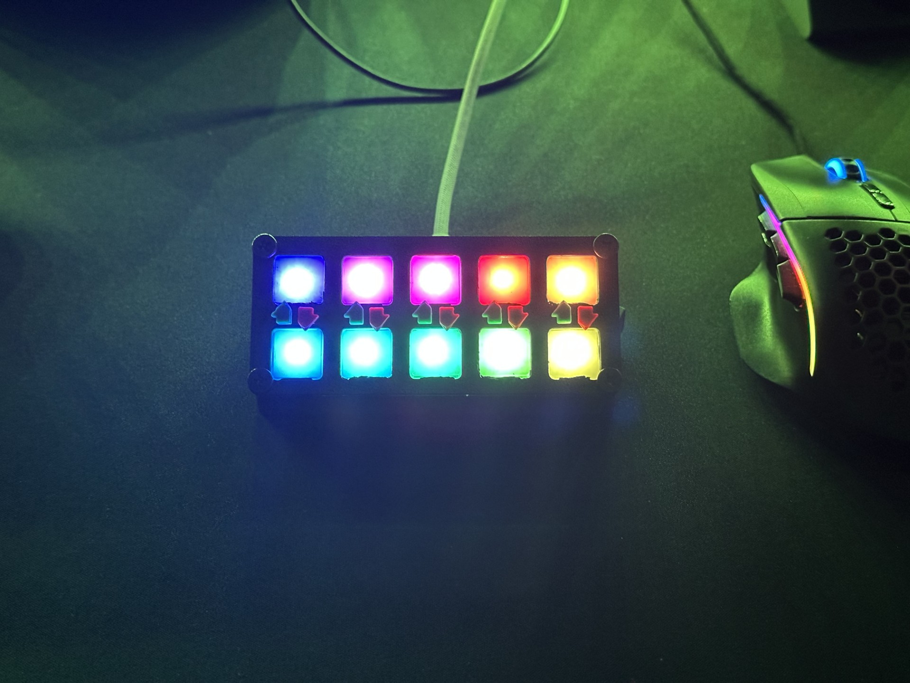
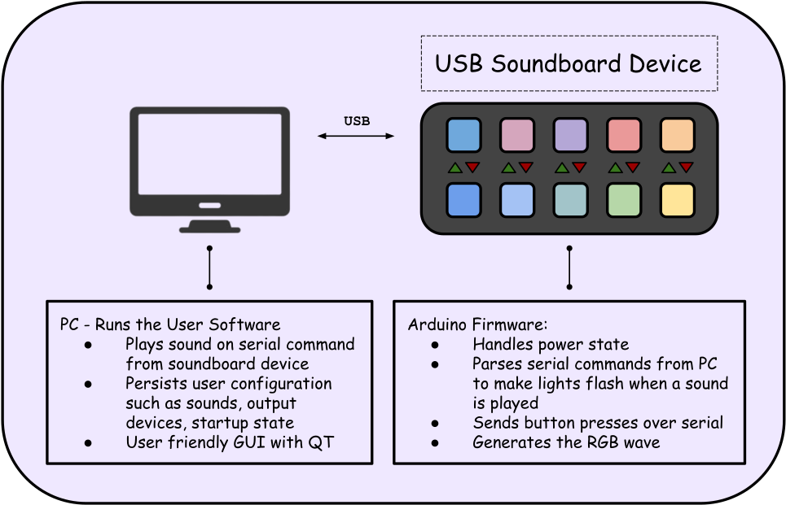
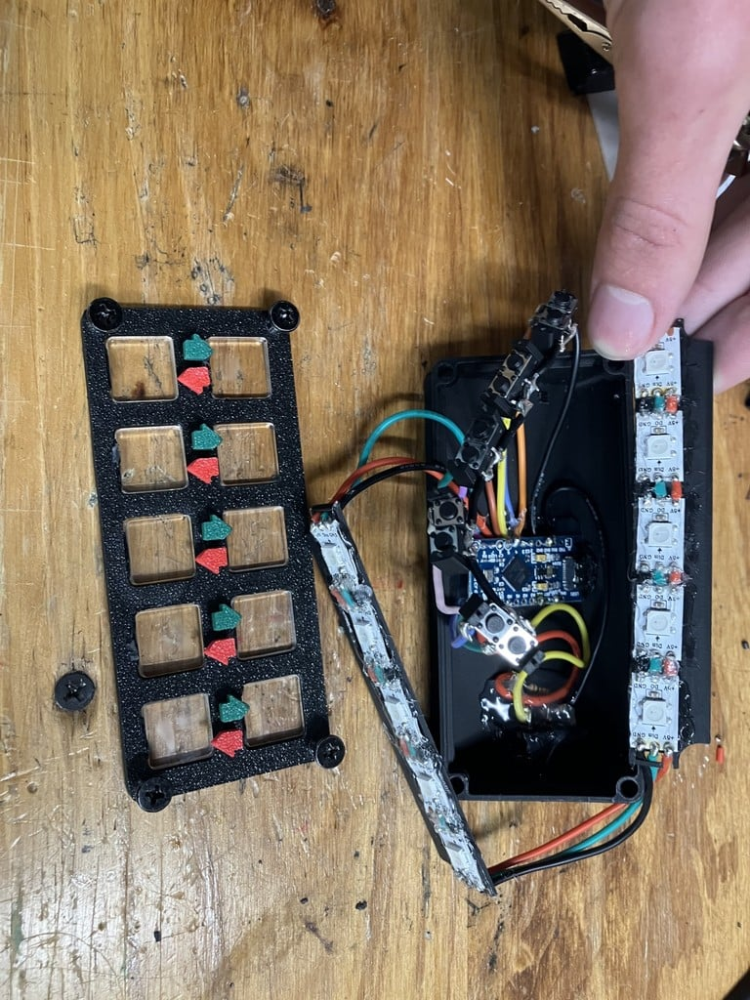
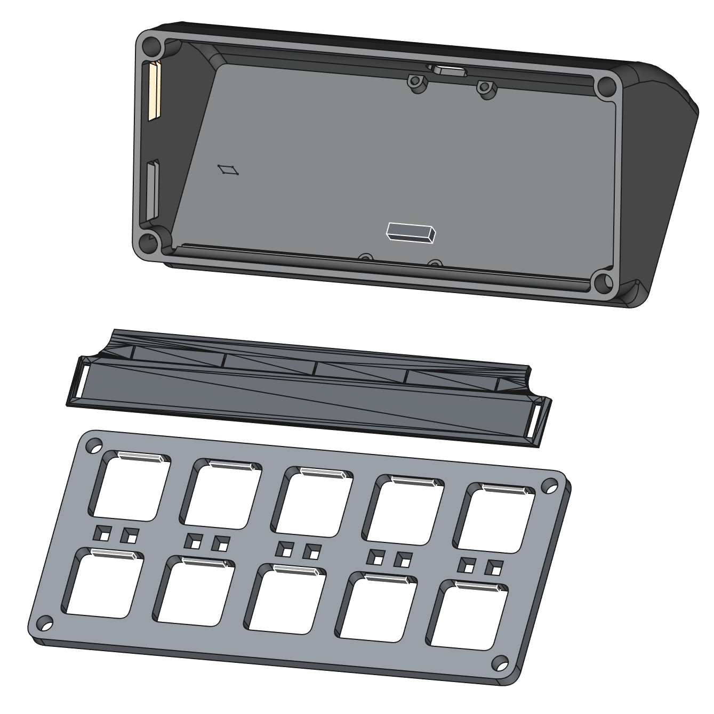
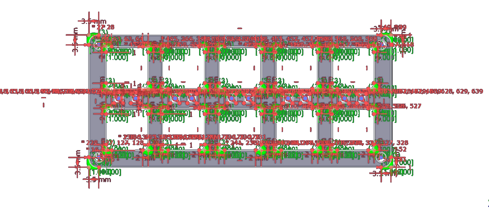
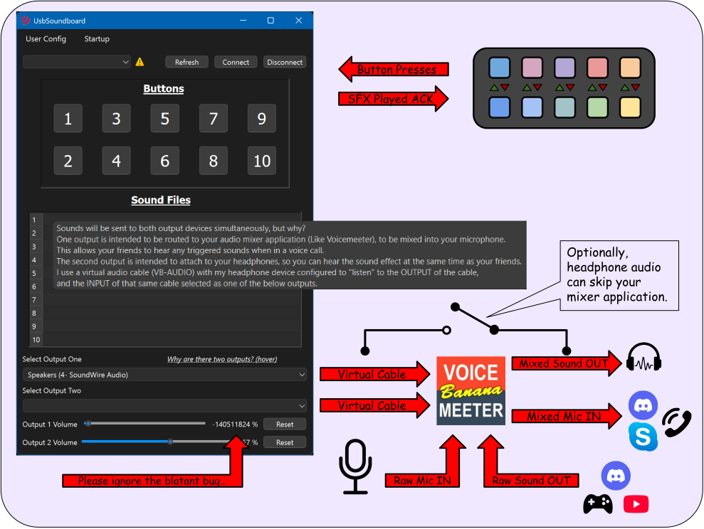

!!! info "Disclaimer"
    _This is not a tutorial! Part of the fun is figuring out how to build it..._

!!! note "TODO"
    Add link to deej mixer project in [Related Projects](#related-projects) once that page is complete

# :material-speaker: USB Soundboard



:loud_sound: **Play SFX to headphones & mic simultaneously**

---

A custom soundboard that allows you to play any sound effect to both your headphones and microphone simultaneously! It plugs right in to your pc via usb-c and serially communicates to my custom user software. _This is a must-have for trolling your friends in voice calls!_

[:octicons-arrow-right-24: Get Started](./usbsoundboard.md#quick-start)&emsp;&emsp;[:octicons-mark-github-16: Source](https://github.com/PolymorphicAgent/USBSoundboard){target="_blank" rel="noopener noreferrer"}&emsp;&emsp;[:simple-thingiverse: Thingiverse](https://www.thingiverse.com/thing:6960227){target="_blank" rel="noopener noreferrer"}


---
## Features

| Feature&emsp;&emsp;&emsp;&emsp;&emsp;&emsp;&emsp;&emsp; | Description |
    |--------|---------|
    | :material-gesture-tap-button:{ .lg .middle } **10 SFX Buttons** | Each button can be mapped to any audio file in the user app. Right-click or drag & drop to assign. |
    |  :octicons-paintbrush-16:{ .lg .middle } **Customizable Tiles** | Plexiglass tiles can be customized with erasable markers - so you can change your labels with your sounds. |
    | :material-toggle-switch:{ .lg .middle } **On / Off Switch** | A satisfying latching On/Off switch puts the device in sleep mode. |
    | :material-led-on:{ .lg .middle } **RGB Idle Animation** | A smooth rainbow wave cycles across all 10 LEDs when idle. The corresponding LED will flash when a sound is triggered. |
    | :material-cog:{ .lg .middle } **User App** | The lightweight user app allows sound mapping, selection audio outputs, and saving persistent profiles (allows your settings to persist across PC restarts). |
    | :material-dock-window:{ .lg .middle } **Minimize to Tray** | The app minimizes to tray so it can run in the background without having another window open.|

---

## Architecture
### System Diagram


---

### Design Decisions
!!! info "LED Feedback is Confirmation-Based"
    The device only blinks an LED when a serial command is received **from** the PC, not when a button is pressed.<br> **This means:**

    - The LED only blinks if the sound **actually played** (the user app is running & properly configured).
    - If the app isn't running, or no sound is assigned for that button, pressing it won't make the light blink.
    - Triggering a sound directly from the app also blinks the corresponding LED on the device.

!!! info "Software Power Switch"
    The power switch does not physically cut power to the arduino. Instead, it puts the device into low-power mode, because the power is being directly supplied over USB. It would be very difficult to place an electrical interrupt in the circuit! 

---

## Hardware
### Components
| Qty | Component | Purpose |
|:---:|-----------|---------|
| 1 | Arduino Pro Micro | Brains |
| 10 | WS2812b / SK6812 addressable LEDs | Per-button RGB (oohhh... ahhhh...) |
| 10 | Momentary pushbuttons | Trigger inputs |
| 1 | Latching switch | Power on/off |
| 1 | 1/8" plexiglass sheet | Button tiles (laser-etchable) |
| [enough](./usbsoundboard.md#wiring) | Small-gauge stranded wire | Internal wiring |
| idk | Light-diffusion sheeting *(optional)* | LED softening (printer paper works) |

!!! tip "Laser Etcher Access"
    It's easiest to cut out the tiles with a laser etcher (I don't know how else you'd do it...). While you're at it, you can also engrave custom designs on them!

---

### Wiring


---

### Schematic


---

### Enclosure



??? example "3D Model Downloads"
    | File | Contents |
    |------|----------|
    | **[Base + Lid + LED Holders (.3mf)](./usbsb-assets/UsbSoundboard-Base+Lid+LED%20holders.3mf)** | Main enclosure parts |
    | **[Small Parts (.3mf)](./usbsb-assets/UsbSoundboard-Small%20Parts.3mf)** | Buttons, other small parts |

    Also available on [:simple-thingiverse: Thingiverse](https://www.thingiverse.com/thing:6960227){ target="_blank" rel="noopener noreferrer" }.

---

### Power
!!! note "Power Usage When Off"
    If your PC provides power to USB peripherals when shut down, the Arduino will remain in low-power sleep mode with the switch off. It won't process anything other than occasionally polling the switch state, but it will draw a small amount of current.

---

## Software
### Serial Protocol

The device and PC communicate over USB serial at **9600 baud**.

=== "Device → PC"

    The device continuously sends the state of all 10 buttons as a pipe-delimited string:

    ```
    0|0|0|0|0|1|0|0|0|0\n
    ```

    Each position corresponds to a button index (0-9). A `1` at position *i* means button *i* is currently pressed.

=== "PC → Device"

    When the app plays a sound at index *i*, it sends the same format back with bit *i* set to `1`. The firmware parses this and flashes the corresponding LED.

    ```
    0|0|0|0|0|1|0|0|0|0\n
    ```

!!! warning "Known Inefficiency"
    The current protocol is poorly designed: both sides constantly send the full state string even when nothing has changed, and the `|` delimiters are redundant. A future redesign would incorporate non-delimited messages sent only on state changes.

---
    
### Directory Structure
??? abstract "Project Tree"
    ```
    USBSoundboard/
    ├── ArduinoFirmware/
    |   └── USBSoundboard.ino                           // The Arduino Firmware
    ├── iconparts/                                      // Contains files pertaining to new and old icons
    |   └── *icon*.png
    ├── images/                                         // Contains images embedded in README.md and on thingiverse
    |   └── *g 
    ├── installer/
    |   ├── Installer Source/                           // Files necessary for the creation of the installer with QTIFW
    |   |   ├── config/...
    |   |   ├── packages/...
    |   |   └── repository/...                          // These files get transferred to polimorph-dev*
    |   ├── UsbSoundboardInstaller.sha1                 // SHA1 hash of the latest installer executable
    |   ├── UsbSoundboardInstaller.sha256               // SHA256 hash of the latest installer executable
    |   └── reference.txt                               // For my reference when I need to create a new installer
    ├── Model/                                          // Files pertaining to the physical design of the device
    |   ├── Big Parts/...                               // Breakdown of conglomerate files
    |   ├── Small Parts/...                             // Breakdown of conglomerate files
    |   ├── Small parts.FCStd
    |   ├── UsbSoundboard-Base+Lid+LED holders.3mf
    |   ├── UsbSoundboard-Small Parts.3mf
    |   └── UsbSoundboard_MODEL.FCStd
    ├── testsounds/                                     // The sounds I used during testing in different formats
    |   ├── mp3/ 
    |   |   └── *.mp3
    |   ├── wav/ 
    |   |   └── *.wav
    |   ├── thisIsAReal...Have/                         // This very long path was used to test a specific edge case
    |   |   └── one.mp3
    |   └── convert.bat                                 // This script converts all MP3 files in the current directory to WAV format
    ├── .gitignore
    ├── README.md
    ├── Soundboard.ui                                   // The UI form for the main window of the application
    ├── UsbSoundboard.pro                               // The main project file
    ├── audiodevicedialog.cpp                           // Blank & unused
    ├── audiodevicedialog.h                             // Blank & unused
    ├── audiomanager.cpp                                // Unused
    ├── audiomanager.h                                  // Unused
    ├── connected.png
    ├── droppablebutton.cpp                             // Custom class that allows file drops on buttons
    ├── droppablebutton.h
    ├── icon.ico
    ├── info.ico
    ├── info.txt                                        // Some cool ascii art that took me too long
    ├── main.cpp                                        // Driver
    ├── mainwindow.ui                                   // Contains the MenuBar, etc.
    ├── resources.qrc                                   // Contains all graphical elements (i.e. images, icons)
    ├── soundboard.cpp                                  // Bulk of the logic (serial comms, Save/Load, etc.)
    ├── soundboard.h
    ├── soundboardwidget.h                              // Some GUI crap to feed user interactions to our main logic
    ├── startuphelp.cpp                                 // Cute little info popup for the mentally challenged
    ├── startuphelp.h
    ├── testconfig.json                                 // Used during testing
    ├── testconfig1.json                                // Used during testing
    ├── trayiconeventfilter.cpp                         // Unused
    └── trayiconeventfilter.h                           // Unused
    ```
    !!! note "* [polimorph-dev](../../server/oracle.md/#polimorph-dev)"

---

### Data Flow


---

## Installation
### Requirements

=== "Hardware"

    - One assembled USB Soundboard device
    - USB-C cable to connect the device to your PC

=== "Software"

    - Windows 11
    - [USB Soundboard User App](https://github.com/PolymorphicAgent/USBSoundboard/releases/latest){ target="_blank" rel="noopener noreferrer" } (latest release from GitHub)

    !!! note "Cross-Platform"
        The user app was designed and tested exclusively on Windows 11. However, Qt is cross-platform and it *may* be possible to compile and run on macOS or Linux. I haven't tested it myself, but feel free to give it a shot if you're interested!

---

### Steps
1. **Connect** the soundboard device to your PC via USB-C
2. **Flash the** [**firmware**](https://raw.githubusercontent.com/PolymorphicAgent/USBSoundboard/refs/heads/main/ArduinoFirmware/USBSoundboard.ino){ target="_blank" rel="noopener noreferrer" } to the Pro Micro if not already flashed
3. **Install the app** by downloading and running the latest installer from [GitHub Releases](https://github.com/PolymorphicAgent/USBSoundboard/releases/latest){ target="_blank" rel="noopener noreferrer" }

!!! warning "Known Issues"
    The app has some stability issues and may crash unexpectedly. The installer also does *not* currently create a desktop shortcut. These are known issues that will be addressed in a future release if and only if someone actually uses this app other than myself...

---

## Quick Start
!!! tip "Let's get this working and over with..."
    1. Select the soundboard from the **serial device dropdown** and hit **Connect**
    2. **Assign sounds**: right-click each numbered button to browse for an audio file, or drag & drop files directly onto the buttons
    3. **Select two audio outputs**: one for your headphones, one for your mixer input (see [Data Flow](#data-flow))
    4. **Set volume** independently for each output
    5. **Save your profile** via `User Config` in the menu bar
    6. *(Optional)* Check options under the `Startup` tab in the Menu Bar

---

## Configuration
Configuration is stored across two types of JSON files:

=== "init.json"

    Startup behavior and recently used profiles.

    | Key | Description |
    |-----|-------------|
    | `loadCfgAtStartup` | Whether to load a user config at startup |
    | `cfgToLoadAtStartup` | Path to the config file to auto-load |
    | `knownConfigs[]` | List of recently opened config files |
    | `saveCfgAtShutdown` | Save config on shutdown if changes were made |
    | `startMinimized` | Launch the app straight to the system tray |

=== "User Config (*.json)"

    Per-profile settings that persist across sessions.

    | Key | Description |
    |-----|-------------|
    | `multiple` | Selected audio devices and their volumes |
    | `serialPort` | Which COM port the device is connected to |
    | `sounds[]` | File path for each of the 10 buttons |

---

## Troubleshooting

!!! question "The app crashed!"
    Yeah, that happens. See [Known Issues](#steps). Restart the app. If it won't start, delete `init.json` and re-select your initialization configuration options

!!! question "LEDs aren't blinking when I press buttons"
    This is by design! LEDs only blink when the PC app **confirms** the sound was played. Make sure the app is running, properly configured, and connected.

!!! question "The device does nothing when the power switch is on"
    Verify the USB connection and check that the correct serial port is selected in the app. Try toggling the power switch off and on again.

---

## Related Projects
//add deej mixer link here

---

## Changelog
### [:material-tag: v1.0.2](https://github.com/PolymorphicAgent/USBSoundboard/releases/tag/v1.0.2){target="_blank" rel="noopener noreferrer"} — Aug 26, 2025 { #v1.0.2 }

:material-label: **Latest**
{ .latest-tag; style="color:green";}

- [x] Added a "Retry" button to the Serial Error Dialog
- [x] Added an informational tooltip to the output device section
- [x] Other small optimizations

### [:material-tag: v1.0.1](https://github.com/PolymorphicAgent/USBSoundboard/releases/tag/v1.0.1){target="_blank" rel="noopener noreferrer"} — Jul 14, 2025 { #v1.0.1 }

- [x] Fixed audio devices sometimes not being remembered from saved config
- [x] Fixed path resolution issues with `init.json`
- [x] Migrated the installer to an Online Installer
- [x] Other small optimizations

### [:material-tag: v1.0.0](https://github.com/PolymorphicAgent/USBSoundboard/releases/tag/first) — Feb 24, 2025 { #v1.0.0 }

- [x] Initial release :tada:

## Contributing

Found a bug or have a feature request?

[:material-github: Open an Issue](https://github.com/PolymorphicAgent/USBSoundboard/issues){ .md-button target="_blank" rel="noopener noreferrer" }


---

<div style="text-align: center; margin-top: 2rem;">
    <p>Made with ☕ by <a href="https://polimorph.dev" target="_blank" rel="noopener noreferrer">PolymorphicAgent</a></p>
    <div style="font-size: 14px; color: #6a6a8a">
        This page was created <b>without</b> the use of AI.
    </div>
</div>