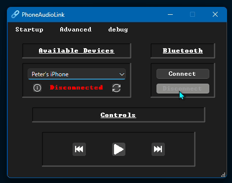
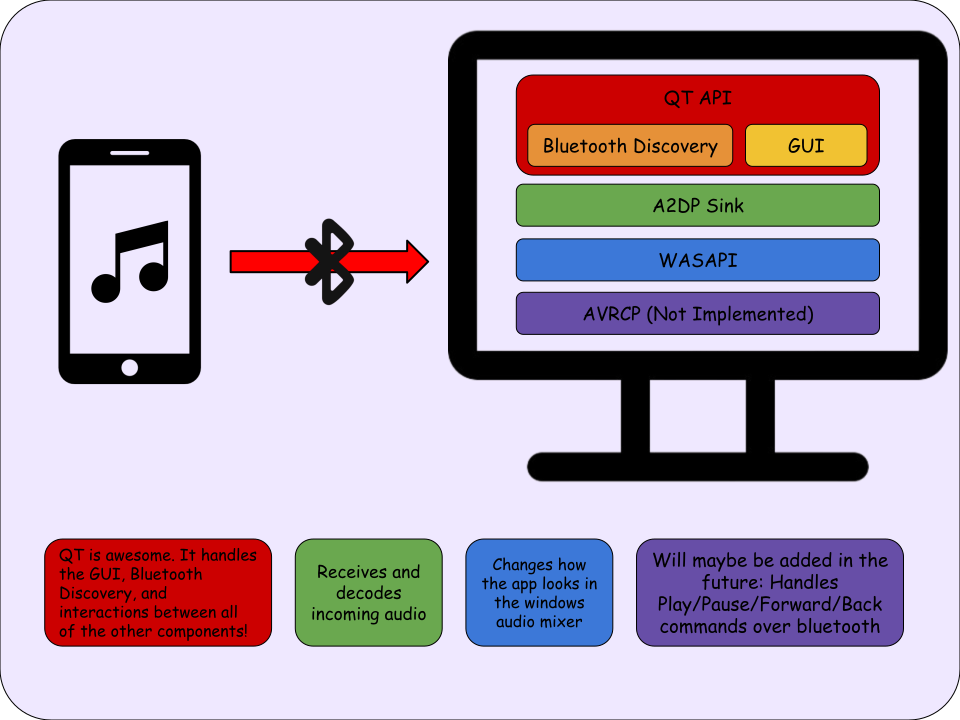
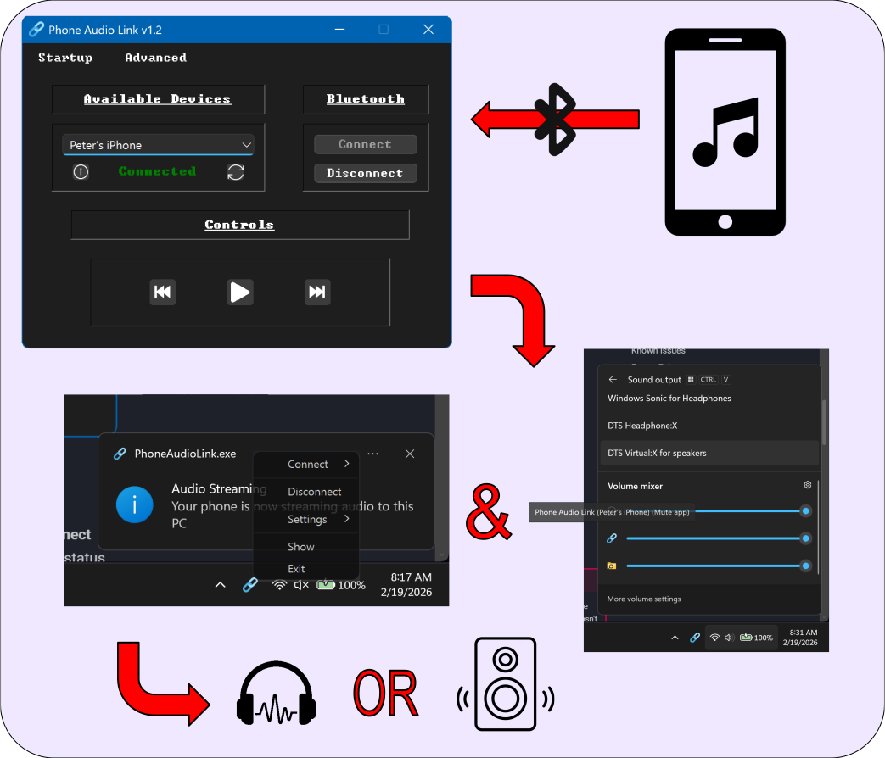
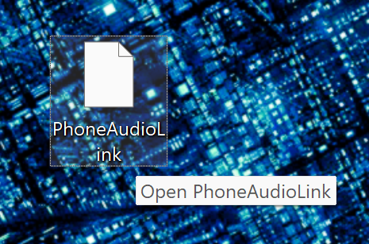

# PhoneAudioLink

!!! warning "Project Status"
    **Functional!** Core A2DP audio streaming works. Media controls need implementation, and, as usual, some bugs need fixing! See [Known Issues](#known-issues) and [Future Enhancements](#future-enhancements).

---

{ loading=lazy; : style="width: 85%" }

:material-cellphone-sound: **Stream Bluetooth audio from your phone to your PC**

---

PhoneAudioLink is a Windows desktop application that turns your PC into a Bluetooth A2DP audio sink, meaning you can stream music, podcasts, or any audio from your phone directly to your computer's speakers. Think of it like using your PC as a Bluetooth speaker, without needing a bluetooth speaker cluttering your desk.

[:octicons-arrow-right-24: Get Started](#quick-start)&emsp;&emsp;[:octicons-mark-github-16: Source](https://github.com/PolymorphicAgent/PhoneAudioLink){target="_blank" rel="noopener noreferrer"}

---

## Features

| Feature&emsp;&emsp;&emsp;&emsp;&emsp;&emsp;&emsp;&emsp;&emsp;&emsp;&emsp;&emsp; | Description |
|--------|---------|
| :material-bluetooth-audio:{ .lg .middle } &nbsp; **A2DP Audio Streaming** | Receive Bluetooth audio from your phone and play it through your PC speakers, using Windows' native `AudioPlaybackConnection` API. |
| :material-cellphone-link:{ .lg .middle } &nbsp; **Device Discovery** | Automatically discovers nearby Bluetooth devices. Filter for phones only, or toggle compatibility mode to show everything. |
| :material-tray-full:{ .lg .middle }&nbsp; **System Tray** | Minimizes to tray so it stays out of the way. Click to restore, middle-click to exit. |
| :material-content-save:{ .lg .middle } &nbsp; **Persistent Settings** | Remembers your selected device, compatibility mode, and startup preferences across restarts via `init.json`. |
| :material-volume-high:{ .lg .middle } &nbsp; **Volume Mixer Branding** | Appears in the Windows Volume Mixer with its own name and icon instead of the generic "Microphone" label, via WASAPI. |
| :material-update:{ .lg .middle } &nbsp; **Auto-Update Checker** | Checks for updates on launch and shows a notification bar (Qt Creator-style) with release notes and a one-click update button. |
| :material-animation-play:{ .lg .middle } &nbsp; **Animated Controls** | Play/pause button crossfades between states. Icons adapt to light/dark system theme. |

!!! note "Media Controls"
    - The buttons exist and animate, but the commands don't actually reach the phone yet. See [Known Issues](#known-issues).

---

## Architecture

### System Diagram



---

## Why Does This Exist?

Windows doesn't natively expose an easy way to receive Bluetooth audio from a phone. You can *send* audio to Bluetooth headphones, but acting as a *receiver*? That requires wrangling with Microsoft's `AudioPlaybackConnection` API, which is buried deep in the WinRT framework and has basically zero user-friendly UI.

I wanted a simple, clean way to stream my phone's audio to my PC. So I built one.

---

### Design Decisions

!!! info "Why Not Qt Bluetooth Sockets?"
    The original version of this project tried to implement A2DP from scratch using `QBluetoothSocket` with RFCOMM. This was **fundamentally wrong** since A2DP requires L2CAP sockets, AVDTP, and codec negotiation (SBC, AAC, etc.), none of which Qt exposes. After hitting that wall, I shelved the project for about a year.

!!! info "Let Windows Do the Heavy Lifting"
    The current architecture delegates all Bluetooth audio handling to Windows' native `AudioPlaybackConnection` API (WinRT). This means Windows handles codec negotiation, audio routing, and stream management and the app just tells it *when* to connect and *to what*. Much more reliable than trying to reimplement Bluetooth from scratch :disappointed_relieved:.

!!! info "Volume Mixer Requires Session Hunting"
    When `AudioPlaybackConnection` creates an audio stream, Windows labels it generically as "Microphone" in the Volume Mixer. To fix this, the `AudioSessionManager` class uses WASAPI's `IAudioSessionManager2` to enumerate **both capture and render** sessions, find the one belonging to our process, and rename it. This was surprisingly difficult, as the session appears under capture (not render) because audio is coming *from* the phone.

---

## Software

### Tech Stack

| Layer | Technology | Role |
|---|---|---|
| **UI** | Qt 6 (Widgets) | Device selection, playback controls, system tray |
| **Bluetooth Discovery** | `QBluetoothDeviceDiscoveryAgent` | Finds nearby phones |
| **A2DP Sink** | Windows `AudioPlaybackConnection` API (WinRT) | Receives and decodes Bluetooth audio natively |
| **Audio Session** | WASAPI (`IAudioSessionManager2`) | Customizes Volume Mixer appearance |
| **Media Controls** | AVRCP (in progress) | Play/pause/skip on the connected phone |
| **Installer** | Qt Installer Framework | Online installer with auto-update support |

---

### Directory Structure

??? abstract "Project Tree"
    ```
    PhoneAudioLink/
    ├── installer/
    |   ├── config/...                          // Qt IFW installer configuration
    |   ├── packages/...                        // Installer package data
    |   └── repository/...                      // These files get transferred to polimorph-dev*
    ├── .gitignore
    ├── README.md
    ├── PhoneAudioLink.pro                      // Main project file
    ├── main.cpp                                // Driver
    ├── phoneaudiolink.h                        // Main window header
    ├── phoneaudiolink.cpp                      // Bulk of the UI logic
    ├── phoneaudiolink.ui                       // Qt Designer form
    ├── bluetootha2dpsink.h                     // WinRT AudioPlaybackConnection wrapper
    ├── bluetootha2dpsink.cpp                   // A2DP sink management
    ├── audiosessionmanager.h                   // WASAPI session customization
    ├── audiosessionmanager.cpp                 // Volume Mixer branding logic
    ├── animatedbutton.h                        // Animated play/pause button
    ├── animatedbutton.cpp                      // Crossfade animation + theme-aware icons
    ├── startuphelp.h                           // Startup instructions dialog
    ├── startuphelp.cpp
    ├── updatechecker.h                         // Background update checking
    ├── updatechecker.cpp
    ├── updatenotificationbar.h                 // Qt Creator-style update banner
    ├── updatenotificationbar.cpp
    ├── releasenotesdialog.h                    // Markdown release notes viewer
    ├── releasenotesdialog.cpp
    ├── a2dpstreamer.h                          // DEPRECATED — original RFCOMM approach
    ├── a2dpstreamer.cpp                        // DEPRECATED — does not work
    ├── resources.qrc                           // Icons, images
    └── icon.ico
    ```
    !!! note "* [polimorph-dev](../../server/oracle.md/#polimorph-dev)"

---

### Core Logic

The connection flow is straightforward once you understand the WinRT async model:

1. **Discovery**: `QBluetoothDeviceDiscoveryAgent` finds nearby devices. The app filters for phone devices by default (checking `majorDeviceClass() == PhoneDevice`), but compatibility mode shows everything.
2. **Sink Creation**: When the user clicks Connect, `BluetoothA2DPSink` calls `AudioPlaybackConnection::TryCreateFromId()` with the device's WinRT ID, registering the PC as an A2DP sink.
3. **Enable & Open**: `StartAsync()` enables the sink, then `OpenAsync()` begins audio streaming. Both are WinRT coroutines, bridged back to Qt's thread via `QMetaObject::invokeMethod`.
4. **Session Branding**: After connecting, `AudioSessionManager` uses WASAPI to find and rename the audio session in the Volume Mixer from "Microphone" to "Phone Audio Link (*device name*)".
5. **Cleanup**: On disconnect, COM objects are released in order. Lazy initialization and aggressive cleanup were added since the process would sometimes hang during debug.

---

### Data Flow



---

## Installation

### Requirements

=== "Software"

    - Windows 10 version 2004 or later
    - A Bluetooth-compatible computer (either built-in or USB dongle)
    - [PhoneAudioLink Installer](https://github.com/PolymorphicAgent/PhoneAudioLink/releases/latest){ target="_blank" rel="noopener noreferrer" } (latest release from GitHub)

=== "Building from Source"

    - Qt 6.2+ with Bluetooth and Multimedia modules
    - QT Creator (easiest)
    - MSVC compiler with C++20 support (for WinRT coroutines)
    - Windows SDK 10.0.19041.0 or later

---

### Build Instructions

!!! note "Only needed if building from source"

- Open `PhoneAudioLink.pro` in QT Creator
- Select the MSVC kit
- Hit Play to build & run

???- note "`.pro` additions for WinRT support"
    ```qmake
    win32 {
        CONFIG += c++20
        QMAKE_CXXFLAGS += /await:strict
        LIBS += -lwindowsapp -lruntimeobject
        DEFINES += WINVER=0x0A00 _WIN32_WINNT=0x0A00
    }
    ```

---

## Configuration

Configuration is stored in a single JSON file:

=== "init.json"

    Created automatically in the app's working directory on first exit.

    | Key&emsp;&emsp;&emsp;&emsp;&emsp;&emsp;&emsp;&emsp;&emsp;&emsp;&emsp;&emsp;&emsp;&emsp;&emsp; | Type | Description&emsp;&emsp; |
    |-----|------|-------------|
    | `maximizeBluetoothCompatability` | `bool` | Show all Bluetooth devices instead of just phones |
    | `connectAutomatically` | `bool` | Auto-connect to the saved device on launch *(not yet implemented)* |
    | `startMinimized` | `bool` | Launch straight to the system tray |
    | `device` | `string` | Bluetooth MAC address of the last selected device |

---

## Quick Start

!!! tip "Let's get streaming..."
    1. **Pair your phone** with your PC via Windows Bluetooth settings (do this first!)
    2. **Launch PhoneAudioLink**
    3. **Select your phone** from the device dropdown (hit the refresh button if it doesn't appear)
    4. **Click Connect**! The status label should turn green and say "Connected"
    5. **Play something on your phone** - audio should come through your PC speakers
    6. *(Optional)* Check options under the `Advanced` menu for compatibility mode, start minimized, etc.

---

## Troubleshooting

!!! question "My phone doesn't show up in the device selection box!"
    - Did you pair it in windows settings before starting the app? If not, do so.
    - Select "Forget this device" in the windows bluetooth settings for your phone, and re-pair. Refresh or re-start the app.

!!! question "No audio plays even though it says connected!"
    - Check the volume on both your phone and PC.
    - Disconnect & Reconnect your phone using the buttons in the UI.
    - Restart the app.

### Known Issues

!!! warning "Media Controls Don't Work"
    The play/pause, forward, and back buttons don't control the phone. When the PC is an **A2DP Sink** (receiving audio), Windows doesn't automatically establish an **AVRCP Controller** connection. The current `SendInput` media key approach only controls local Windows media apps, not the phone. A proper AVRCP implementation is [planned](#avrcp-controller).

!!! bug "Process Hangs on Exit (Debug Builds)"
    The UI and tray icon disappear, but the process lingers in Task Manager under "Background processes." Caused by COM objects (WASAPI) and/or WinRT async operations not being fully released before `QApplication::quit()`. Mitigated with lazy initialization and aggressive cleanup, but not fully resolved. This does not happen in release builds, however.

!!! bug "Crash on Minimize (Intermittent)"
    A GitHub user reported the app crashing when minimized. The suspected cause is `saveInitData()` accessing the device combo box when it's empty or has no valid `QBluetoothDeviceInfo` data. A guard has been added, but the bug hasn't been fully reproduced.

!!! bug "Duplicate Connection Notification"
    The "streaming audio" notification fires twice on connect. `AudioPlaybackConnection` emits multiple state change events that both trigger the `connectionOpened` signal.

!!! bug "Broken Icons"
    On some computers, icons may appear like this: <br><br>
        &emsp;&emsp;
        { loading=lazy; : style="width: 18%" } &emsp;&emsp;&emsp;
        { loading=lazy; : style="width: 25%" } <br><br>
    This is a low priority fix.

---

### Debugging

??? info "Useful Debug Actions **FOR DEBUG BUILDS ONLY**"
    The `Advanced → Debug` menu action prints to console:

    - The currently selected device name
    - Its pairing status with the local Bluetooth adapter
    - Its advertised service UUIDs

    Helpful for diagnosing why a device won't connect or isn't being discovered.

---

## Future Enhancements

### AVRCP Controller

This is the big one. To actually control phone playback from the PC, the app needs to act as an AVRCP Controller and send properly formatted binary commands over an RFCOMM connection. This involves:

- Establishing an RFCOMM socket to the phone's AVRCP Target service
- Constructing valid AVRCP command packets (play, pause, next, previous)
- Parsing AVRCP response and notification packets
- Displaying track metadata (title, artist, album) in the UI
- Handling album art retrieval (multi-packet assembly)

The groundwork for this has been thought out but not yet integrated. <b>Claude estimates it will take 3,000 lines of code</b> :scream: to implement, so this may never actually get implemented!

### Other Planned Features

- **Volume control integration**: adjust phone volume from the PC
- **Connection history**: remember and quick-select previously connected devices
- **Keyboard shortcuts**: global hotkeys for media controls
- **UI state management**: grey out buttons when disconnected, change label text dynamically based on state
- **Linux support**: BlueZ via D-Bus for A2DP sink functionality (long-term future like *years*)

---

## Resources

### References

- [AudioPlaybackConnection API (Microsoft Docs)](https://learn.microsoft.com/en-us/uwp/api/windows.media.audio.audioplaybackconnection){ target="_blank" rel="noopener noreferrer" }
- [WASAPI IAudioSessionManager2 (Microsoft Docs)](https://learn.microsoft.com/en-us/windows/win32/api/audiopolicy/nn-audiopolicy-iaudiosessionmanager2){ target="_blank" rel="noopener noreferrer" }
- [AVRCP Specification (Bluetooth SIG)](https://www.bluetooth.com/specifications/specs/a-v-remote-control-profile-1-6-2/){ target="_blank" rel="noopener noreferrer" }

### Related Projects

- [USB Soundboard](../hw/usbsoundboard.md): another Qt project with system tray integration, similar config persistence, and shared `StartupHelp` dialog code

---

## Project History

| When | What |
|---|---|
| ~2022 | Initial development using `QBluetoothSocket` with RFCOMM. Hit a wall — wrong protocol stack entirely. |
| ~2023 | Project shelved. |
| Late 2024 | Revived with a new architecture using Windows' native `AudioPlaybackConnection` API. Core streaming works. |
| Late 2024 | Added Volume Mixer customization (WASAPI), system tray, settings persistence, installer, auto-update system. |
| Ongoing | AVRCP Controller implementation for media controls. Bug fixes. |

---

## Changelog

!!! note "TODO"
    update to use the new TODO fence

### :material-tag: v1.0.0 — 2024 { #v1.0.0 }

:material-label: **Latest**
{ .latest-tag; style="color:green";}

- [x] A2DP audio streaming via `AudioPlaybackConnection`
- [x] Bluetooth device discovery with phone filtering
- [x] System tray integration
- [x] Settings persistence (`init.json`)
- [x] Custom Volume Mixer branding via WASAPI
- [x] Animated play/pause button with theme awareness
- [x] Auto-update checker with release notes dialog
- [x] Qt IFW online installer with optional desktop shortcut
- [x] Initial release :tada:

---

## Contributing

Found a bug or have a feature request?

[:material-github: Open an Issue](https://github.com/PolymorphicAgent/PhoneAudioLink/issues){ .md-button target="_blank" rel="noopener noreferrer" }

---

<div style="text-align: center; margin-top: 2rem;">
    <p>Made with ☕ by <a href="https://polimorph.dev" target="_blank" rel="noopener noreferrer">PolymorphicAgent</a></p>
    <div style="font-size: 14px; color: #6a6a8a">
        This page was created with the assistance of AI.
    </div>
</div>