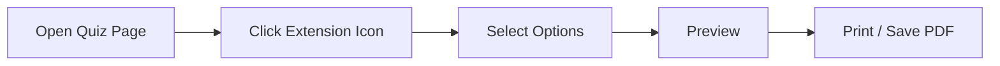
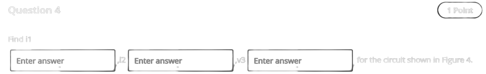

# Blackboard Print

Convert Blackboard Ultra quizzes to clean, printer-friendly PDFs.

!!! warning "DISCLAIMER"
    - DOUBLE CHECK TO MAKE SURE THAT ALL THE QUESTIONS ARE PRESENT IN THE GENERATED OUTPUT! I DO NOT TAKE RESPONSIBILITY IF A BUG CAUSES YOUR PRINTED DOCUMENT TO EXCLUDE CONTENT. USE AT YOUR OWN RISK, UNDERSTANDING THAT THIS EXTENSION WAS CODED IN A LITTLE UNDER A WEEK AND A HALF. YOU HAVE BEEN WARNED.
    - Image-based questions may not extract perfectly
    - Blackboard's HTML structure is inconsistent and frequently changed, so expect the extension to break from time to time!
    - If you find any major problems, feel free to [open an issue](https://github.com/PolymorphicAgent/PrintBB/issues) with a detailed explanation of how to reproduce the problem!

---

## Overview

**Blackboard Print** is a Chrome extension that extracts questions from Blackboard quizzes and generates printable documents. It's designed for Syracuse University's Blackboard setup, but may work with other institutions using Blackboard Ultra.

!!! success "Key Benefits"
    &emsp;&emsp;:material-file-pdf-box: &nbsp; Clean output with Blackboard's UI removed<br>
    &emsp;&emsp;:material-image: &nbsp; Automatic image extraction (diagrams, pictures, etc.)<br>
    &emsp;&emsp;:material-form-textbox: &nbsp; Fill-in-blank fields converted to underlines<br>
    &emsp;&emsp;:material-cog: &nbsp; Customizable output options<br>

---

## Installation

### From Chrome Web Store

1. Visit the <a href="https://chromewebstore.google.com/detail/blackboard-print/mfkodoichibecnjoackcdomjncoofbbi" target="_blank" rel="noopener noreferrer">Chrome Web Store Listing</a>
2. Click **Add to Chrome**
3. Confirm by clicking **Add extension**

!!! tip "Pinning the Extension"
    For quick access, click the puzzle piece icon (:material-puzzle:) in Chrome's toolbar and pin **Blackboard Print**.

### Manual Installation (Developer Mode)

??? abstract "For development or testing"
    
    1. Download and extract the archive from the latest release on <a href="https://github.com/PolymorphicAgent/PrintBB/releases/latest" target="_blank" rel="noopener noreferrer">github</a>.
    2. Open Chrome and navigate to `chrome://extensions/`
    3. Enable **Developer mode** (toggle in top-right)
    4. Click **Load unpacked**
    5. Select the folder that was extracted from the archive in (1)
    
    ```
    PrintBB-vX.X.X/
    ├── manifest.json
    ├── popup.html
    ├── popup.js
    ├── content.js
    └── icons/
        └── icon_*.png
    ```

---

## Usage

### Basic Workflow



### Step-by-Step

1. **Navigate to your quiz** on Blackboard Ultra
   
    !!! info "Supported Pages"
        - Quiz attempts (before submission)
        - Not tested on any other page

2. **Click the extension icon** in your toolbar
   
    The popup will display:
    
    | Status | Meaning |
    |--------|---------|
    | :material-check-circle:{ .success } Found X question(s) | Quiz detected successfully |
    | :material-check-circle:{ .success } with Y fill-in blanks | FITB questions detected |
    | :material-alert-circle:{ .warning } No quiz content found | Page not recognized.<br> Make sure you're on the right page,<br> or open an issue if you believe it's a bug! |

3. **Configure your options** (see [Options](#options) below)

4. **Click Preview First** to review the output

5. **Print or Save as PDF**
    - Press ++ctrl+p++ (or ++cmd+p++ on Mac)
    - Select **Save as PDF** or your printer
    - Click **Save** / **Print**

---

## Options

### Output Settings

| Option | Description | Default |
|--------|-------------|---------|
| :material-alert-circle:{ .warning } **Include correct answers** | Show correct answers if visible on page | :material-checkbox-marked: On |
| :material-alert-circle:{ .warning } **Include feedback** | Include instructor feedback | :material-checkbox-marked: On |
| **Include point values** | Show points per question | :material-checkbox-marked: On |
| **Compact mode** | Reduce spacing for denser output | :material-checkbox-blank-outline: Off |
| **One question per page** | Force page breaks between questions | :material-checkbox-blank-outline: Off |

!!! warning " Options marked with :material-alert-circle:{ .warning }"
    _Not tested!_

### Preview Controls

Once in preview mode, you have additional controls:

=== "Edit Mode"

    Enable **Edit Mode** to make corrections before printing:
    
    - Fix typos or formatting issues
    - Add text
    - Remove unwanted content
    
    !!! warning
        Edits are not saved—they only affect the current print job.

=== "Print Button"

    Click **Print / Save as PDF** or use the keyboard shortcut:
    
    - Windows/Linux: ++ctrl+p++
    - macOS: ++cmd+p++

---

## Supported Question Types

### Fill-in-the-Blank (FITB)

The extension automatically detects inline answer fields and converts them to underlines:

!!! example "Before & After"
    
    **Blackboard Ultra:**
    > 
    
    **PDF Output:**
    > Find i1 \_\_\_\_\_\_\_\_\_\_\_\_\_\_\_, i2 \_\_\_\_\_\_\_\_\_\_\_\_\_\_\_, v3 \_\_\_\_\_\_\_\_\_\_\_\_\_\_\_, for the circuit shown in Figure 4.

!!! note "Editing"
    _You can easily edit the spacing between lines and number of underscores in Editing Mode!_

### :material-alert-circle:{ .warning } Multiple Choice

- Answer choices should be listed with letter markers (A, B, C, D...)
- Selected answers should be highlighted (if visible)
- Correct answers should be marked with :material-check: (if available)

### :material-alert-circle:{ .warning } Short Answer / Essay

- Text areas should be converted to lined space
- Student responses should be included if reviewing a submission

!!! warning " Formats marked with :material-alert-circle:{ .warning }"
    _Not tested! There is a high chance that they get messed up or straight up don't work at all!_

### Images & Figures

Embedded images are automatically extracted:

- Diagrams, figures, graphs and charts
- Images and screenshots
- etc.

!!! note "Image Sources"
    Images hosted on `bbcswebdav` (Blackboard's content server) are included directly. External images may require authentication and their inclusion is not guaranteed!

---

## Troubleshooting

### Extension Not Detecting Quiz

??? question "The popup says 'No quiz content found'"
    
    **Possible causes:**
    
    1. **Wrong page type** — Make sure you're on an actual quiz _attempt_ page, not the description page
    2. **Page not fully loaded** — Wait for the page to finish loading, then try again
    3. **Different Blackboard version** — The extension was only tested for SU's Blackboard Ultra; other versions/institutions may not be parsed correctly

### Images Not Appearing

??? question "Images show as broken or missing"
    
    **Possible causes:**
    
    1. **Authentication required** — Some images require an active Blackboard session
    2. **External hosting** — Images hosted outside Blackboard may not be accessible
    
    **Try this:**
    
    1. Make sure you're logged into Blackboard
    2. Open the image in a new tab to verify it loads
    3. Use Preview mode and check if images appear there

### PDF Formatting Issues

??? question "Output looks wrong or has extra content"
    
    **Try this:**
    
    1. Enable **Compact mode** if there's too much whitespace
    2. Enable **One question per page** if questions are splitting awkwardly
    3. Use **Edit Mode** to remove unwanted elements and/or add spaces/text before printing

### Wrong Question Count

??? question "Extension shows more/fewer questions than expected"
    
    This can happen if Blackboard's HTML structure varies. The extension counts questions by looking for specific CSS classes. If questions are nested unusually, the count may be off.
    
    **The PDF output should still be correct** — the count is just for display purposes.

**If you believe you found a bug:**

- Open an issue on the [github](https://github.com/PolymorphicAgent/PrintBB/issues) with a detailed description of how to reproduce the misbehavior

---


## Privacy & Permissions

### Permissions Explained

| Permission | Why It's Needed |
|------------|-----------------|
| `activeTab` | Access the current Blackboard page when you click the extension |
| `scripting` | Inject the extraction script to read quiz content |
| `host_permissions` | Run only on Blackboard domains (`*.blackboard.com`) |

### Data Handling

!!! info "Your Data Stays Local"
    
    - :material-close: No data is sent to external servers
    - :material-close: No analytics or tracking
    - :material-close: No account required
    - :material-check: All processing happens locally in your browser

---

## Technical Details

### Browser Compatibility

| Browser | Support |
|---------|---------|
| Chrome | :material-check-circle:{ .success } Full support |
| Edge (Chromium) | :material-check-circle:{ .success } Full support |
| Firefox | :material-close-circle:{ .error } Not supported (Manifest V3) |
| Safari | :material-close-circle:{ .error } Not supported |

### Version History

#### v1.0.0

- [x] Initial release
- [x] Blackboard Ultra support
- [x] Fill-in-the-blank question extraction
- [x] Image extraction
- [x] Compact mode
- [x] One question per page option
- [x] Edit mode in preview

---

## Contributing

Found a bug or have a feature request?

[:material-github: Open an Issue](https://github.com/PolymorphicAgent/PrintBB/issues){ .md-button }


---

<div style="text-align: center; margin-top: 2rem;">
    <p>Made with ☕ by <a href="https://polimorph.dev">PolymorphicAgent</a></p>
    <div style="font-size: 14px; color: #6a6a8a">
        This page was created with the help of Claude AI.
    </div>
</div>